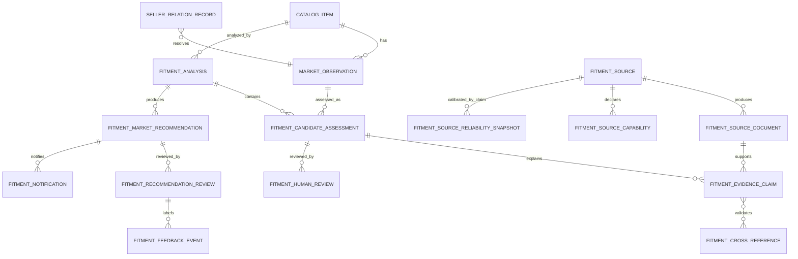
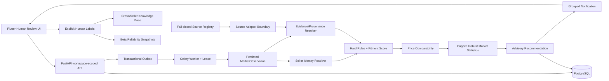
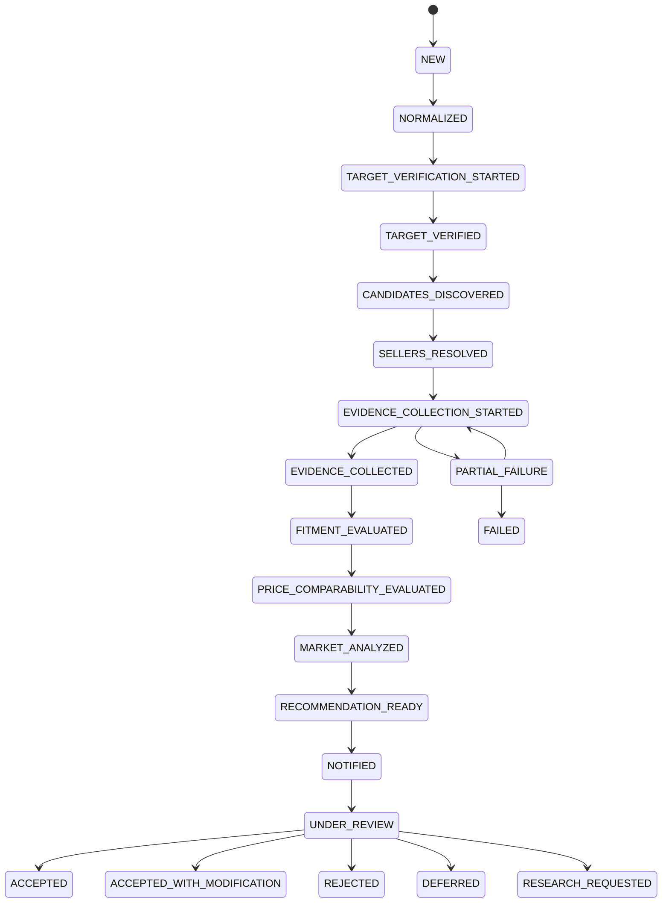

# Metis Human-in-the-loop Competitive Pricing — implementation contract

Дата состояния: 2026-07-21

Stage ID: `METIS_HITL_COMPETITIVE_PRICING_IMPLEMENTATION_2026_07_21`

Fitment contract: `metis-distributed-fitment-v2`

Fitment scoring: `fitment-logit-v2`

Market contract: `metis-hitl-market-v1`

Recommendation contract: `metis-hitl-recommendation-v1`

Этот документ является одновременно техническим контрактом, картой фактической реализации и
production stop-gate. Он не объявляет доказанной точность на всём каталоге Юрия: синтетические
регрессионные тесты доказывают свойства кода, но не заменяют репрезентативную ручную разметку
живых предложений.

## 1. Executive Summary

В проекте реализован P0-контур evidence-first fitment и human-in-the-loop pricing:

1. существующий Prom extraction component не переписан;
2. найденное предложение остаётся discovery candidate, пока identity и fitment не подтверждены;
3. собственные и связанные магазины исключаются из внешней рыночной статистики;
4. OE, cross, автомобиль, сторона, ось и технические признаки хранятся отдельными claims с
   provenance;
5. hard rejection требует одного сильного Tier A/B отрицательного факта либо двух независимых
   отрицательных provenance-кластеров;
6. compatibility и price comparability вычисляются раздельно;
7. активная `sale_price` отделена от зачёркнутой `reference_price`;
8. цена за пару/комплект не попадает в статистику без доказуемой нормализации до одной штуки;
9. рыночная статистика использует capped weights, weighted quantiles, log-MAD и effective sample
   size;
10. рекомендация неизменно требует human approval, а автоматическая публикация на Prom отсутствует
    и запрещена DB constraint;
11. решения, feedback, reliability snapshots, notifications и audit trail сохраняются;
12. обработка выполняется идемпотентной Celery-задачей с lease/retry/outbox;
13. Flutter показывает evidence, причины включения/исключения, нормализованную цену, confidence и
    кнопки принятия, изменения, отклонения, defer и research.

Реализованный software stage проходит тесты. Production activation остаётся заблокированной до
получения разрешённых источников и репрезентативных live-метрик precision/false-accept/seller
exclusion.

## 2. Confirmed Project Context

- Marko владеет каталогом, пользователями, workspace, import, runs и UI.
- Metis владеет детерминированными identity/fitment/comparability/statistics/recommendation
  контрактами.
- Целевой каталог содержит 4 901 позицию.
- Первичный marketplace — Prom.ua.
- Известные storefront заказчика: KEMP, Parts Avto, АвтоБуст, ПРОФПАРТС. Название не считается
  устойчивым seller ID.
- Блоки «цей товар у інших продавців» и «схоже в інших продавців» являются discovery-источниками,
  но не доказательством идентичности или независимости продавца.
- Существующий Prom parser заморожен до воспроизводимого parser defect. Новая логика размещена
  вокруг его persisted output.
- Автоматическое изменение цены не входит в scope.

## 3. Assumptions

1. Пользователь имеет право анализировать собственный каталог и вручную зарегистрированные
   Prom-страницы в пределах принятой source policy.
2. Raw cost не должен передаваться в новый recommendation endpoint; backend получает только
   одобренный derived floor.
3. `PartIdentity` — нормализованный snapshot, но сам по себе не является authoritative evidence.
4. `UNKNOWN` означает недостаток доказательств, а не отрицание.
5. Currency conversion не выполняется без timestamped FX evidence.
6. VAT считается включённым только при явном или policy-backed подтверждении.
7. Human-confirmed knowledge не удаляется TTL автоматически; оно переоценивается новой версией.
8. Synthetic dataset не является representative live-market gold set.

## 4. Open Questions That Are Not Blocking

- Какой юридически подтверждённый режим доступа к Prom будет записан как
  `PERMITTED` или `OWNER_RISK_ACCEPTED`?
- Какие official manufacturer APIs/каталоги доступны по договору?
- Какой целевой contribution margin и marketplace variable rate задаёт Юрий?
- Нужен ли отдельный reviewer role или owner/editor достаточно для первого pilot?
- Какой SLA уведомлений: немедленно, hourly digest или daily batch?
- Какие категории допускают side-neutral и homogeneous-kit normalization?

Ответы меняют policy/configuration, но не требуют переписывать реализованный spine.

## 5. Functional Requirements

| ID | Требование | Реализация | Статус |
|---|---|---|---|
| FR-01 | Импорт каталога и synthetic seed без обязательного URL | существующий catalog pipeline | implemented |
| FR-02 | Prom candidate collection | frozen parser + persisted observations | implemented boundary |
| FR-03 | Own/related seller exclusion | `seller_relation_records`, noisy-OR resolver | implemented |
| FR-04 | OE/article/cross evidence | claims + documents + KB | implemented |
| FR-05 | Fitment hard rules и score | `metis.fitment.engine` | implemented |
| FR-06 | Unit and commercial comparability | separate gate | implemented |
| FR-07 | Robust market statistics | `metis.fitment.hitl` | implemented |
| FR-08 | Advisory price | immutable recommendation snapshot | implemented |
| FR-09 | Human review | API + Flutter actions | implemented |
| FR-10 | Feedback/reliability | explicit labels + Beta snapshots | implemented |
| FR-11 | Notification | grouped persistent notification + API | implemented |
| FR-12 | External catalog retrieval | fail-closed adapter contract | gated by permission |
| FR-13 | Full 4 901-product scheduling | queue foundation exists | rollout pending |

## 6. Non-Functional Requirements

- Determinism: одинаковый input/source/config snapshot даёт тот же результат.
- Idempotency: enqueue, processing, recommendation и review имеют idempotency boundaries.
- Tenant isolation: каждый DB/API lookup ограничен `workspace_id`.
- Auditability: решение указывает evidence IDs, source document hash, versions и reason codes.
- Fail-closed: неизвестный seller/unit/source permission не допускается в pricing.
- Durability: PostgreSQL хранит immutable evidence/reviews; Celery job использует lease.
- Scalability: async queue, batch source authorization и capped evidence aggregation.
- Security: no raw cost in new endpoint, no auto publication, URL/source policy allowlist.
- Observability: job metrics, workflow state, failures, evidence counts and human outcomes.
- Reversibility: recommendation только совет; human decision не вызывает marketplace mutation.

## 7. Domain Model

Ключевое разделение:

```text
Product != Offer
Seller != Storefront != SellerGroup
Discovery candidate != verified part identity
Physical compatibility != price comparability
sale_price != reference_price
search OE != extracted OE != verified OE
Human approval != marketplace publication
```



## 8. Source Feasibility Matrix

Проверено 2026-07-21. Это engineering policy, не юридическое заключение.

| Источник | Потенциальные claims | Публичная автоматизация | Текущий gate |
|---|---|---|---|
| Prom public listing | discovery, seller, sale/reference price, raw attributes | Условия не дают явного bulk/API grant; нужен зафиксированный owner/legal decision | `UNKNOWN` или явно зарегистрированный `OWNER_RISK_ACCEPTED` |
| 7zap | OE, supersession, fitment | [Terms](https://7zap.com/en/pages/terms-of-service/) запрещают bots, scrapers, automated/semi-automated extraction и external database accumulation | `NOT_PERMITTED` без отдельного письменного соглашения |
| PartSouq | OEM article, substitutions, vehicle catalog | [Terms](https://partsouq.com/en/terms-2.html) описывают покупку, но не дают автоматизационного/API права | `UNKNOWN`; retrieval запрещён до разрешения |
| Official manufacturer catalog/API | article, OE, cross, fitment | зависит от конкретного производителя, API/license/robots/terms | per-source `UNKNOWN` до review |
| User-provided PDF/XLSX | catalog facts | зависит от прав пользователя и происхождения файла | `PERMITTED` только с provenance declaration |
| Marketplace mirrors/search snippets | discovery only | не повышают authority и часто коррелированы | Tier D/E, pricing-ineligible alone |

Код не превращает запись source в разрешение. `SourceAdapterPolicy.retrieval_authorized` требует
одновременно допустимый status, `robots_checked`, `terms_checked`, непустой
`access_reference` и заявленную capability.

## 9. Source Reliability Model

Надёжность хранится по паре `(source_id, claim_type)`, а не одной оценкой на весь сайт.

```text
prior:
  Tier A = Beta(19, 1)
  Tier B = Beta(8, 2)
  Tier C = Beta(6, 4)
  Tier D = Beta(4, 6)
  Tier E = Beta(2, 8)

r_source,claim = (alpha + confirmed) /
                 (alpha + beta + confirmed + rejected)
```

Обновление происходит только по explicit evidence verdict от человека. Click/accept без label не
обучает систему. PostgreSQL advisory lock сериализует обновление одного reliability scope и
предотвращает lost update.

Эффективный вес claim:

```text
e = r_source,claim
  * extraction_confidence
  * directness
  * freshness_factor
  * independence_factor
```

## 10. Candidate Discovery Strategy

Порядок запросов:

1. exact normalized manufacturer article;
2. brand + article;
3. article + vehicle;
4. article + installation position;
5. target OE;
6. target OE + vehicle;
7. confirmed one-hop cross;
8. Prom similar blocks как discovery-only;
9. multilingual query variants: uk/ru/en.

Каждый discovery result сохраняет query, URL, retrieval time, raw capture hash и source route.
Поисковый OE записывается как `search_oe_norm`; он никогда не присваивается
`verified_matched_oe_norm`.

## 11. Product Normalization

```text
part_number_norm(x) =
  remove_non_[0-9A-Z](uppercase(NFKC(x)))
```

Leading zeros сохраняются. Бренд и manufacturer article нормализуются отдельно; один article у
разных брендов не считается одной деталью.

Vehicle normalization хранит:

- make/model;
- generation/platform;
- year interval;
- engine/body;
- market;
- installation side/axle;
- technical specifications.

Price boundary:

```text
active_price = explicit sale/discount price, если валидна
reference_price = более высокая зачёркнутая/original price
market math consumes active_price only
```

## 12. Seller Resolution

Для совпадения `m_k in [0,1]` и веса `w_k`:

```text
relation_score = 1 - product(1 - w_k * m_k)
```

Deterministic identifiers (`legal_entity`, platform owner ID, payout details, registry match)
имеют приоритет. Copied catalog signals (description, image set, SKU pattern, synchronized price)
объединяются в один provenance group с cap `0.30`.

```python
if registry_match or deterministic_identifier:
    relation = OWN
elif score >= 0.95 and strong_identifier:
    relation = OWN
elif score >= 0.80:
    relation = RELATED
elif score >= 0.55:
    relation = POSSIBLY_RELATED
else:
    relation = UNKNOWN  # не доказанная независимость
```

Для pricing допускается только `INDEPENDENT` + stable seller ID + seller group. OWN/RELATED имеют
нулевой внешний вес. Несколько storefront одной группы получают один общий weight cap.

## 13. OE Verification

Identity evidence разделено на:

- `article_identity`;
- `oe_exact`;
- направленный `oe_supersession`;
- `cross_confirmed`.

Отсутствие OE — `UNKNOWN`, а не contradiction. Один OE-текст в Prom listing — Tier D claim и не
может единолично подтвердить или опровергнуть деталь. Exact OE разрешает разные бренды: бренд
используется для part identity/tier, а не как запрет cross-tier сравнения.

## 14. Cross-reference Verification

Cross хранится со scope:

```json
{
  "brand": "SACHS",
  "article": "317193",
  "oe": "48530-89025",
  "relation_type": "aftermarket_cross",
  "vehicle_scope": {"make": "Toyota", "model": "Camry", "generation": "XV40"},
  "installation_position": "rear_right",
  "relation_status": "source_confirmed",
  "independent_source_clusters": 2,
  "human_confirmation_count": 1
}
```

Допускается one-hop expansion. Транзитивное замыкание не используется. Weak cross требует двух
независимых подтверждений; противоречия не удаляются и переводят relation в `conflicting`.

## 15. Fitment Evidence Model

```json
{
  "evidence_id": "uuid",
  "candidate_offer_id": "uuid",
  "source_id": "uuid",
  "source_document_id": "uuid",
  "feature": "side",
  "value": -1,
  "polarity": "contradicts",
  "statement_status": "FACT",
  "source_tier": "A",
  "source_reliability": 0.95,
  "extraction_confidence": 0.93,
  "directness": 0.95,
  "freshness_factor": 1.0,
  "independence_factor": 1.0,
  "correlation_group": "manufacturer_official",
  "source_url": "https://example.invalid/document",
  "source_document_sha256": "64-hex",
  "raw_fragment": "rear left"
}
```

Разрешённые polarity: `supports|contradicts|neutral|unknown`. Разрешённые statement statuses:
`FACT|INFERENCE|ASSUMPTION|UNKNOWN|CONFLICT`. External page text всегда data, никогда instruction
для агента.

## 16. Fitment Mathematics

По каждому feature и provenance group:

```text
positive_f,g = max(e for supports)
negative_f,g = max(e for contradicts)
P_f = 1 - product_g(1 - positive_f,g)
N_f = 1 - product_g(1 - negative_f,g)
F_f = min(P_f, N_f)
A_f = 1 if max(P_f, N_f) > 0.10 else 0
```

Веса:

| Dimension | Weight |
|---|---:|
| exact article identity | 0.18 |
| exact OE or supersession | 0.24 |
| confirmed aftermarket cross | 0.16 |
| part category | 0.08 |
| axle | 0.08 |
| side | 0.08 |
| vehicle make/model | 0.07 |
| generation/platform | 0.05 |
| year | 0.02 |
| engine | 0.01 |
| body | 0.01 |
| critical technical specs | 0.02 |
| vehicle market hard-scope feature | 0.00 |
| **sum** | **1.00** |

```text
M = sum(w_f * P_f)
N = sum(w_f * N_f)
C = sum(w_f * A_f)
F = sum(w_f * F_f)
K = missing_critical_weight / total_critical_weight

z = -1.8 + 5.2*M - 6.5*N + 1.0*C - 2.8*F - 2.2*K
score = sigmoid(z)
```

Это heuristic score, не статистически доказанная probability. Calibration допускается после live
gold set; до этого `calibrated_probability = null`.

## 17. Hard Rejection Rules

Hard reject имеет приоритет над score, но требует подтверждения:

```text
confirmed contradiction =
  one Tier A/B FACT with effective_weight >= 0.60
  OR
  at least two independent FACT groups with effective_weight >= 0.50
```

Применяемые коды:

- `SIDE_MISMATCH`;
- `AXLE_MISMATCH`;
- `PART_CATEGORY_MISMATCH`;
- `VEHICLE_MAKE_MISMATCH`;
- `VEHICLE_MODEL_MISMATCH`;
- `GENERATION_MISMATCH`;
- `VEHICLE_MARKET_MISMATCH`;
- `YEAR_RANGE_DISJOINT`;
- `CRITICAL_TECHNICAL_MISMATCH`;
- `OE_IDENTITY_CONFLICT`, если нет verified supersession/cross bridge.

Одиночный слабый конфликт получает `UNVERIFIED_*_MISMATCH`, не может стать confirmed и идёт в
manual review. UNKNOWN не создаёт hard reject.

## 18. Price Comparability Model

Физически совместимый товар допускается в pricing только после коммерческой проверки:

- human/automatic eligibility fitment state;
- independent seller;
- condition;
- normalized quantity/unit;
- product scope;
- tier;
- VAT basis;
- currency;
- availability;
- stable seller and part identity.

```text
c_j = condition_factor
    * quantity_factor
    * tier_factor
    * tax_factor
    * currency_factor
    * product_scope_factor
```

`used vs new = 0`; unknown unit/currency/tier остаётся manual review и имеет price weight 0.
Out-of-stock не задаёт рыночную цену.

Unit normalization:

```text
pair with proven quantity 2 -> sale_price / 2
axle set with proven homogeneous quantity 2 -> sale_price / 2
heterogeneous kit -> UNKNOWN
quantity conflict -> INCOMPATIBLE
```

## 19. Price Recommendation Mathematics

Для предложения `j`:

```text
W_j = p_j^2 * c_j * q_j * a_j * f_j * d_j * u_j
```

После cap одного `part_identity_key <= 1.5` и одного seller group `<= 1.0`:

```text
n_eff = (sum W_j)^2 / sum(W_j^2)
```

Weighted quantile:

```python
def weighted_quantile(rows, q):
    rows = sorted((price, weight) for price, weight in rows if weight > 0)
    threshold = q * sum(weight for _, weight in rows)
    cumulative = 0
    for price, weight in rows:
        cumulative += weight
        if cumulative >= threshold:
            return price
    return rows[-1][0] if rows else None
```

Outlier:

```text
y_j = ln(price_j)
m = weighted_median(y_j)
MAD_w = weighted_median(abs(y_j - m))
outlier if abs(y_j - m) > 3.5 * 1.4826 * MAD_w
```

Recommendation:

```text
aggressive anchor = weighted Q20
balanced anchor = weighted Q35
margin_first anchor = weighted median
buffer = max(absolute_buffer, percentage_buffer * anchor)
P_market = anchor - buffer
P_raw = max(P_market, approved_price_floor) when floor exists
P_limited = clip(P_raw, current*(1-max_down), current*(1+max_up))
```

Hard floor имеет приоритет над rate guardrail: если floor выше upper guardrail, совет поднимается до
floor и получает предупреждение.

Confidence:

```text
Q_sample = min(1, n_eff/5)
Q_diversity = min(1, independent_seller_groups/4)
Q_stability = exp(-log_price_IQR/0.35)

confidence =
  0.25*Q_fitment + 0.15*Q_source + 0.15*Q_freshness
  + 0.15*Q_sample + 0.15*Q_diversity + 0.10*Q_stability
  + 0.05*Q_completeness
```

Сумма confidence weights равна 1.00. При `n_eff < 2`, seller groups < 2 или confidence ниже
threshold числовой совет не выдаётся.

## 20. Human-in-the-loop Workflow

1. Система создаёт immutable recommendation и grouped notification.
2. Reviewer видит market range, confidence factors, `n_eff`, seller groups, candidate evidence,
   warnings и reason codes.
3. Действия: Accept, Accept with modification, Reject, Defer, Request research.
4. Цена ниже approved floor требует двух явных флагов.
5. Решение создаёт append-only review, feedback event и audit event.
6. Никакое действие не вызывает Prom publication.
7. Evidence verdicts обновляют source reliability только при explicit label.
8. Blind online learning запрещён.

## 21. Component Architecture

| Компонент | Фактическая реализация |
|---|---|
| Prom Candidate Collector | existing parser/gateway + MarketObservation |
| Normalization | `metis/fitment/engine.py`, offer processing |
| Seller Resolver | `metis/fitment/hitl.py`, `fitment_intelligence.py` |
| Source Registry/Router | DB models, routes, `fitment_source_routing.py` |
| Adapter policy | `fitment_source_adapters.py` |
| Evidence/Provenance | source documents + evidence claims |
| Fitment Rules/Scoring | `metis/fitment/engine.py` |
| Price Comparability | same deterministic engine |
| Market/Recommendation | `metis/fitment/hitl.py`, `fitment_hitl.py` |
| Queue | Celery task + outbox + lease |
| Human UI | Flutter fitment feature |
| Feedback/KB | reviews, feedback events, cross references |
| Notification | fitment notifications + API |
| Audit/Evaluation | audit events, metrics endpoint, fixture dataset |

## 22. Mermaid Architecture Diagram



## 23. Mermaid Sequence Diagram

```mermaid
sequenceDiagram
  actor H as Human reviewer
  participant U as Flutter
  participant A as FastAPI
  participant D as PostgreSQL
  participant Q as Celery
  participant M as Metis deterministic core
  H->>U: Open product review
  U->>A: GET candidates/recommendation
  A->>D: workspace-scoped read
  H->>U: Run analysis
  U->>A: POST analyze + idempotency key
  A->>D: analysis + outbox in one transaction
  Q->>D: claim lease
  Q->>M: evidence snapshots + normalized identities
  M-->>Q: fitment/comparability assessments
  Q->>D: append claims, assessments, audit
  H->>U: Generate advisory price
  U->>A: POST recommendation
  A->>M: robust market + advisory price
  M-->>A: recommendation requiring approval
  A->>D: recommendation + notification + audit
  H->>U: Accept/modify/reject/defer/research
  U->>A: POST explicit decision
  A->>D: append review + feedback; no marketplace write
```

## 24. State Machine



## 25. Database Schema

Migration `20260721_0020_hitl_competitive_pricing.py` extends the fitment spine:

- `market_observations.sale_price/reference_price`;
- `fitment_analyses.workflow_state`;
- normalized unit fields in candidate assessments;
- evidence directness;
- source capabilities;
- per-claim Beta reliability snapshots;
- immutable market recommendations;
- recommendation reviews;
- feedback events;
- grouped notifications.

Append-only triggers protect sources, documents, assessments, claims, reviews, cross records,
recommendations and feedback. Mutable notification read status is intentionally excluded.

## 26. SQL DDL

Representative production constraints:

```sql
CREATE TABLE fitment_market_recommendations (
  id uuid PRIMARY KEY,
  workspace_id uuid NOT NULL REFERENCES workspaces(id),
  analysis_id uuid NOT NULL REFERENCES fitment_analyses(id),
  catalog_item_id uuid NOT NULL REFERENCES catalog_items(id),
  idempotency_key varchar(64) NOT NULL,
  input_fingerprint char(64) NOT NULL,
  action varchar(40) NOT NULL,
  current_price numeric(18,2) NOT NULL,
  recommended_price numeric(18,2),
  confidence numeric(5,4) NOT NULL CHECK (confidence BETWEEN 0 AND 1),
  candidate_decisions jsonb NOT NULL,
  reason_codes jsonb NOT NULL,
  configuration_snapshot jsonb NOT NULL,
  automatic_price_change_allowed boolean NOT NULL DEFAULT false
    CHECK (NOT automatic_price_change_allowed),
  created_at timestamptz NOT NULL DEFAULT now(),
  UNIQUE (workspace_id, idempotency_key),
  UNIQUE (analysis_id, input_fingerprint)
);

CREATE TABLE fitment_source_reliability_snapshots (
  id uuid PRIMARY KEY,
  workspace_id uuid NOT NULL REFERENCES workspaces(id),
  source_id uuid NOT NULL REFERENCES fitment_sources(id),
  claim_type varchar(40) NOT NULL,
  prior_alpha numeric(12,4) NOT NULL CHECK (prior_alpha > 0),
  prior_beta numeric(12,4) NOT NULL CHECK (prior_beta > 0),
  confirmed_count integer NOT NULL CHECK (confirmed_count >= 0),
  rejected_count integer NOT NULL CHECK (rejected_count >= 0),
  reliability numeric(5,4) NOT NULL CHECK (reliability BETWEEN 0 AND 1),
  based_on_feedback_event_id uuid REFERENCES fitment_feedback_events(id),
  created_at timestamptz NOT NULL DEFAULT now()
);
```

Полный DDL задаётся Alembic migration; ORM и migration checks синхронизированы.

## 27. API Design

Base: `/api/v1/fitment`. Все endpoints требуют authenticated `CurrentUser` и workspace scope.

| Method/path | Назначение | Idempotency/audit |
|---|---|---|
| POST `/products/{id}/analyze` | enqueue analysis | client key + request hash; queued event |
| GET `/products/{id}/candidates` | evidence cards | read-only |
| POST `/candidates/{id}/review` | human fitment/evidence labels | key; review/feedback events |
| POST `/sellers/{id}/mark-own` | deterministic registry decision | key; seller audit |
| POST `/sellers/{id}/mark-related` | relation decision | key; seller audit |
| POST `/sellers/resolve` | noisy-OR preview | deterministic read/compute |
| GET/POST `/cross-references/*` | search/confirm/reject KB | append-only |
| GET/POST `/analysis-jobs/*` | status/metrics/retry | lease-safe retry |
| GET/POST `/sources/*` | registry/doc/capability/reliability | policy events |
| POST `/products/{id}/recommendations` | immutable advice | key + input fingerprint |
| GET `/products/{id}/recommendation` | latest advice | read-only |
| POST `/recommendations/{id}/{action}` | human decision | key; no publication |
| GET `/notifications` | grouped inbox | paginated |
| POST `/notifications/{id}/read` | read status | audit |

Errors: `400 invalid contract`, `401 unauthenticated`, `403 forbidden`, `404 not found`,
`409 idempotency conflict`, `422 domain validation`, `503 temporary source/runtime failure`.

## 28. JSON Schemas

Recommendation create request:

```json
{
  "$schema": "https://json-schema.org/draft/2020-12/schema",
  "type": "object",
  "required": ["idempotency_key", "analysis_id", "strategy"],
  "additionalProperties": false,
  "properties": {
    "idempotency_key": {"type": "string", "minLength": 1, "maxLength": 64},
    "analysis_id": {"type": "string", "format": "uuid"},
    "strategy": {
      "enum": ["aggressive", "balanced", "margin_first", "inventory_clearance", "custom"]
    },
    "approved_price_floor": {"type": ["number", "null"], "exclusiveMinimum": 0},
    "absolute_buffer": {"type": "number", "minimum": 0},
    "percentage_buffer": {"type": "number", "minimum": 0, "maximum": 1}
  }
}
```

`cost`, `publish` и `automatic_price_change_allowed` намеренно отсутствуют.

Review request:

```json
{
  "idempotency_key": "client-operation-key",
  "approved_price": 2050.00,
  "reason_code": "price_not_representative",
  "comment": "Operator adjustment",
  "accept_with_modification": true,
  "allow_below_floor": false,
  "below_floor_warning_confirmed": false
}
```

## 29. Source Adapter Interfaces

```python
class SourceAdapter(Protocol):
    source_id: str
    policy: SourceAdapterPolicy

    async def is_available(self) -> bool: ...
    async def search_by_article(self, brand: str | None, article: str) -> list[SourceResult]: ...
    async def search_by_oe(self, oe_number: str) -> list[SourceResult]: ...
    async def search_fitment(self, article: str, vehicle: VehicleQuery) -> list[SourceResult]: ...
    async def fetch_document(self, result: SourceResult) -> SourceDocument: ...
```

Capabilities: `search_by_article|search_by_oe|search_fitment|fetch_document`.

Error taxonomy:

```text
temporary_error, permanent_error, access_denied, captcha_required,
rate_limited, not_found, parser_error, schema_error, circuit_open,
source_not_permitted
```

Adapter сначала вызывает `policy.require(capability)`. CAPTCHA/paywall/rate-limit не обходятся.

## 30. Queue and Job Design

```text
analyze_target_product
├─ normalize_target
├─ verify_target_oe
├─ collect_persisted_prom_candidates
├─ resolve_sellers
└─ analyze_candidates
   ├─ authorize_source_document
   ├─ aggregate_provenance
   ├─ apply_hard_rules
   ├─ calculate_fitment
   └─ calculate_price_comparability
then robust_market -> recommendation -> notification -> human_review
```

Transactional enqueue сохраняет analysis и outbox атомарно. Worker claims lease; stale lease можно
повторно забрать. Request hash и per-analysis uniqueness делают replay идемпотентным.

Retry:

```text
delay_n = min(max_delay, base_delay * 2^n + jitter)
max_attempts = 4
default base = 1s
default max = 60s
```

Retry только для temporary/rate-limited ошибок. Access denied, not permitted, validation и
permanent schema errors terminal. Circuit breaker: 5 последовательных failures, recovery window
5 минут.

## 31. Cache Strategy

Cache key = SHA-256(`source_id + capability + canonical query`).

| Fact | TTL |
|---|---:|
| official article↔OE | 180 days |
| supersession | 90 days |
| marketplace price/availability | 1 day |
| seller profile | 7–30 days |
| seller relation | 30 days |
| human-confirmed cross | no automatic deletion |

Cache entry содержит source, retrieved_at, document hash, policy version и verification status.
Запрещено кэшировать бесконтрольную копию внешнего каталога.

## 32. Security

- Firebase/OIDC authentication and backend-owned authorization;
- workspace ID on every mutable/read path;
- PostgreSQL constraints and append-only triggers;
- TLS in deployment, encryption at rest and secret manager requirement;
- external URL validation, domain allowlist and SSRF-safe resolver;
- parser/browser sandbox and bounded timeout;
- prompt injection treated as untrusted page content;
- no secret or raw cost in Flutter/logs/recommendation payload;
- no automatic marketplace mutation;
- explicit below-floor confirmation;
- idempotency conflict protection.

## 33. Compliance

Запрещены CAPTCHA bypass, paywall/auth bypass, rate-limit circumvention, stolen data, bulk copying
и создание локального клона запрещённого каталога. Retrieval — query-level для конкретной
`article ↔ OE ↔ vehicle scope` пары. Сохраняются короткий factual fragment, URL, date, document
hash и policy reference. 7zap network adapter не активируется без отдельного соглашения.

## 34. Observability

Job trace включает ingestion, normalization, seller resolution, source authorization, evidence,
hard rules, fitment, unit normalization, pricing, recommendation и human decision.

Метрики:

- candidate counts by status;
- hard rejection and reason-code rates;
- source failures/conflicts/reliability;
- cache hits;
- evidence clusters per candidate;
- own/related exclusions;
- normalized/unknown/incompatible unit rates;
- `n_eff`, seller groups, outlier count;
- recommendation confidence/action;
- acceptance/modified/rejection rates;
- queue age, attempts, lease expiry, latency;
- notifications pending/read;
- manual review rate/time.

## 35. Evaluation Dataset

`backend/tests/fixtures/fitment_evaluation_dataset_v1.json` содержит 36
`synthetic_adversarial` случаев и явно `representative: false`. Покрыты exact article/OE,
cross, supersession, side/axle, generation/engine/body/market, copied evidence, own sellers,
used/new, piece/pair, VAT/currency, out-of-stock, typo price, universal/side-neutral и
electronic-vs-standard suspension.

Live gold set должен добавлять минимум:

- 200 вручную размеченных offers;
- sampling по категориям и confidence buckets;
- отдельную adjudication выборку disagreements;
- seller-group truth;
- unit/condition/tier labels;
- inclusion-in-pricing label.

## 36. Test Strategy

| Layer | Проверка | Текущее доказательство |
|---|---|---|
| Pure math | weights, Beta, noisy-OR, quantiles, MAD, `n_eff`, floor | unit tests |
| Automotive rules | positive/negative/unknown/conflict/hard proof | adversarial dataset |
| API schema | auth, endpoints, no cost/publish fields | contract tests |
| Persistence | constraints, triggers, migration head | clean PostgreSQL migration |
| Queue | enqueue, lease, worker, replay | PostgreSQL integration |
| HITL | recommendation, notification, accept, feedback | PostgreSQL integration |
| Frontend | parsing/API/controller widgets | Flutter tests |
| Whole backend | regression across pricing/matching/governance | full pytest |

Required variations are executable: strong/weak positive, strong contradiction, no evidence,
conflicting evidence, ten correlated mirrors, two independent sources, side mismatch, unit pair,
outlier, insufficient sample and below-floor decision.

## 37. Rollout Plan

1. Offline replay: fixtures/captures, no network, no notification to customer.
2. 20-OE live pilot: explicit source policy, manual labels, zero auto actions.
3. 60-OE stratified pilot: precision and seller/unit gates.
4. 100–200 SKU shadow run: compare exact OE vs one-hop cross.
5. 1 000–2 000 catalog expansion: caching, queue load, notification digest.
6. 4 901 full catalog: only after source, precision, observability and rollback gates.

Promotion criteria are numerical; «green tests» alone не продвигают stage.

## 38. Implementation Backlog

Каждая строка содержит goal; dependencies; input→output; acceptance; main risk; test.

### P0

| Task | Контракт |
|---|---|
| Product schema | goal stable seed; dep import; XLSX→CatalogItem identity; AC no hidden URL; risk mapping; test real preview/import |
| Prom collection | goal candidates; dep frozen parser; URL/capture→observations; AC empty != schema drift; risk drift; contract replay |
| Normalization | goal stable IDs; dep dictionaries; raw→normalized+provenance; AC leading zeros; risk over-normalization; adversarial |
| Own seller registry | goal authoritative owner set; dep workspace; IDs→records; AC rename-safe; risk stale IDs; PG integration |
| Seller exclusion | goal clean market; dep resolver; offers→seller groups; AC own precision target; risk shared feed; labeled pilot |
| OE/article extraction | goal identity claims; dep captures; text/JSON→claims; AC search OE separated; risk hallucination; fixture provenance |
| Source routing | goal legal/effective routes; dep policy; brand/query→route; AC fail closed; risk stale terms; policy tests |
| Evidence store | goal replay; dep sources/docs; claims→append-only rows; AC hashes/version; risk storage; migration tests |
| Hard rules | goal prevent false analogs; dep evidence; confirmed conflict→reject; AC weak source cannot hard reject; risk false reject; adversarial |
| Fitment score | goal rank candidates; dep claims; P/N/C/F/K→score; AC weights=1; risk uncalibrated; synthetic tests |
| Unit normalization | goal per-piece prices; dep quantity evidence; sale→unit price; AC unknown excluded; risk heterogeneous kits; unit tests |
| Weighted statistics | goal robust market; dep eligible offers; W→quantiles/n_eff; AC caps/outliers; risk sparse sample; math tests |
| Human review UI | goal explain/action; dep API; snapshots→cards/actions; AC no auto publish; risk overload; Flutter tests |
| Feedback storage | goal explicit learning labels; dep reviews; decisions→events; AC no blind learning; risk click noise; PG integration |
| Audit log | goal traceability; dep all writes; events→append-only log; AC replay lineage; risk PII; trigger tests |

### P1

| Task | Контракт |
|---|---|
| PartSouq adapter | goal OEM evidence; dep written permission; query→fact; AC policy authorized; risk terms; mocked adapter + approved sandbox |
| 7zap adapter | goal catalog evidence; dep separate agreement; query→fact; AC prohibited while absent; risk legal; fail-closed test |
| Manufacturer adapters | goal Tier A facts; dep per-brand API/license; query→document; AC capability/policy; risk heterogeneous schema; contract fixtures |
| Source reliability | goal per-claim quality; dep explicit labels; feedback→Beta snapshot; AC concurrency safe; risk biased labels; PG test |
| Provenance clustering | goal de-correlate mirrors; dep source metadata; docs→groups; AC ten copies=one; risk hidden supplier; adversarial |
| Seller graph | goal storefront grouping; dep identifiers; signals→relations; AC weak alone not own; risk false ownership; labeled metrics |
| Cross KB | goal reuse verified relations; dep evidence/review; cross→versioned edge; AC scope/no transitive leap; risk stale fitment; replay |
| Recommendation confidence | goal calibrated abstention; dep live labels; factors→confidence; AC weights=1; risk optimism; calibration report |
| Notification batching | goal low operator load; dep notifications; events→digest; AC group/dedupe; risk delayed urgent item; batch test |
| Evaluation dashboard | goal release evidence; dep metrics; labels→precision/coverage; AC confidence intervals; risk selection bias; snapshot test |

### P2

| Task | Контракт |
|---|---|
| Active learning | goal label efficiency; dep gold set; impact×uncertainty×EIG→queue; AC audit sample; risk feedback loop; offline eval |
| Automatic calibration | goal calibrated probability; dep representative labels; score→Platt/isotonic; AC Brier/ECE; risk drift; temporal holdout |
| Vehicle dictionaries | goal higher scope coverage; dep licensed data; aliases→canonical IDs; AC versioned; risk wrong merges; gold tests |
| Inventory pricing | goal clearance strategy; dep stock/sales; inventory→anchor; AC floor-safe; risk margin loss; simulation |
| Sales velocity | goal impact/priority; dep transactions; history→factor; AC leakage-free; risk seasonality; time split |
| Source drift | goal detect parser/catalog changes; dep captures; schemas→alerts; AC empty != drift; risk false alarm; daily contract |
| Multi-marketplace | goal broader evidence; dep permission/adapters; offers→normalized model; AC per-source policy; risk currency/VAT; integration |
| Image hashing | goal weak seller/product clue; dep privacy/storage; images→cluster signal; AC never sole proof; risk copied OEM photos; adversarial |

## 39. Risk Register

| Risk | Probability/impact | Control | Residual gate |
|---|---|---|---|
| false compatible analog | medium/critical | authoritative hard rules, review | live precision |
| own storefront counted | medium/high | registry + strong-ID resolver + caps | seller truth set |
| copied error amplification | high/high | provenance max/noisy-OR caps | clustering metrics |
| pair treated as piece | medium/high | fail-closed normalization | unit labels |
| stale/reference price used | medium/high | sale/reference boundary | live capture tests |
| unauthorized source | medium/critical | policy.require + no adapter | written permission |
| parser drift appears empty | medium/high | explicit schema outcome contract | daily live monitor |
| biased human labels | medium/high | explicit evidence verdicts, audit samples | reviewer QC |
| sparse market overconfidence | high/high | `n_eff`, diversity, abstention | coverage pilot |
| DB race/lost reliability update | low/medium | advisory lock, append snapshots | load test |
| tenant leak | low/critical | workspace filters/auth | integration security audit |
| operator assumes publish | medium/high | UI warning + DB false constraint | usability test |

## 40. Acceptance Criteria

Software acceptance:

- no auto price path — PASS;
- every recommendation requires manual approval — PASS;
- evidence/provenance/audit/versioning — PASS;
- weak copied evidence cannot hard reject/confirm — PASS;
- own/related sellers and unknown units have zero pricing admission — PASS;
- robust stats and abstention — PASS;
- clean migration + queue/review integration — PASS;
- API/UI contract — PASS.

Production acceptance still requires measured:

- `precision_confirmed >= 0.90`;
- likely precision target 0.75–0.80;
- right/left and front/rear exclusion >= 0.95;
- own seller precision >= 0.98;
- representative source coverage;
- reviewer acceptance/modification/rejection rates;
- latency/load/backup/restore/rollback evidence.

## 41. Benchmark Case Walkthrough

Target fixture: Toyota Camry XV40/V40, 2006–2011, rear-right shock absorber, declared OE
`48530-89025`, KEMP. Candidate examples in the master prompt are hypotheses, not truth.

Execution:

1. normalize target/article/OE without integer coercion;
2. collect Prom discovery cards;
3. collapse known KEMP/Parts Avto/АвтоБуст/ПРОФПАРТС seller group;
4. separate right from left and rear from front;
5. require article/OE/cross provenance;
6. keep unknown official catalog as unknown;
7. normalize sale/reference and piece/pair;
8. calculate price only from independent eligible seller groups;
9. if `n_eff < 2`, return insufficient evidence;
10. show all excluded cards/reasons to reviewer;
11. persist human labels and cross decisions.

Ни SACHS/KYB/SATO/JAPANPARTS article из prompt не объявляется совместимым без повторной
source-backed проверки.

## 42. Final Recommended Architecture

Сохранять текущую модульную архитектуру FastAPI + PostgreSQL + Redis/Celery + Flutter:

- parser остаётся extraction component;
- immutable evidence spine находится между collection и Metis math;
- pure deterministic Metis core не делает network/DB/UI operations;
- source adapters активируются только через policy registry;
- recommendation snapshot отделён от human decision;
- marketplace publishing отсутствует;
- ML/LLM используется только для extraction/review assistance и не заменяет hard rules;
- репрезентативная calibration добавляется версией после pilot, не «обучается на кликах».

## 43. Production Readiness Checklist

| Gate | Статус | Evidence / blocker |
|---|---|---|
| Code compiles/lints | PASS | Python compile + Ruff; Flutter analyze in ASCII verification copy |
| Backend regression | PASS | full pytest |
| Flutter tests | PASS | full Flutter test |
| Clean PostgreSQL migration | PASS | empty disposable DB to Alembic head |
| Queue/HITL persistence | PASS | PostgreSQL integration |
| Deterministic math | PASS | focused/adversarial tests |
| No auto publication | PASS | API omission + DB constraint + UI |
| Source permission | BLOCKED | Prom decision/reference required; 7zap prohibited; PartSouq unknown |
| Representative live validity | BLOCKED | synthetic dataset is not representative |
| Seller precision >= 98% | BLOCKED | needs labeled live seller set |
| Fitment precision target | BLOCKED | needs 20/60/200 live rollout |
| Calibration | BLOCKED | no representative labels |
| Load/backup/restore/rollback | BLOCKED | no current production drill evidence |
| Production activation | BLOCKED | all preceding hard gates must close |

### Final validation passes

1. Structural: все 43 раздела, diagrams, ER, DDL, JSON, API, enums/interfaces, retry/cache/error
   taxonomy, tests, risks и backlog присутствуют.
2. Mathematical: fitment and confidence weights sum to 1; inputs bounded; zero denominators guarded;
   negative lowers score; UNKNOWN does not increase coverage; caps prevent duplicate inflation;
   `n_eff` and log-MAD tested.
3. Automotive: side/axle/generation/engine/body/market/technical/condition/unit distinctions tested.
4. Evidence-first and contradiction-first variations converge on the same hard-rule outcomes.
5. Adversarial: ten copied pages count as one; weak source cannot hard reject; exact cross bridge
   resolves raw OE difference; own storefronts and out-of-stock offers do not set market price.
6. Production: provenance/audit/versioning/human approval/retries/migration present; source
   permission, representative metrics and operational drills remain explicit blockers.
