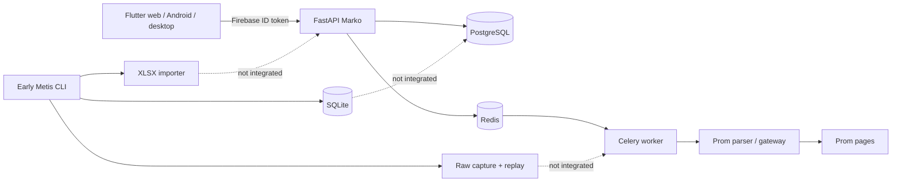
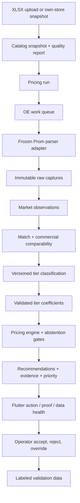

# Metis / Marko: фактический аудит, целевая модель и production-план

> **Implementation update, 2026-07-16.** Документ ниже фиксирует аудит до
> реализации. В текущем коде уже реализованы pricing domain, XLSX import,
> migrations `20260716_0005` + `20260716_0006`, run-level calibration barrier, Celery collection и
> calculation queues, append-only evidence/audit API и Flutter catalog/pricing
> screens. Проверять актуальное состояние следует по коду и README; пункты
> `не реализовано` ниже являются историческим входным backlog, а не текущим
> статусом.

**Дата аудита:** 2026-07-16  
**Основной объект:** текущий код Marko в `marko — копия/`  
**Сопоставленная ветка:** ранний prototype Metis в `/Users/leonidpofa/VSCodeHruchevoPY/SaaS/metis_alpha/metis/`  
**Цель:** отделить факты от намерений, определить строгое ядро ценообразования и дать проверяемый путь до production.

---

## 0. Executive verdict

### 0.1. Главный вывод

**На момент исходного аудита Metis и Marko были двумя не сведёнными реализациями одного продуктового замысла.**

- **Metis** — бизнес-продукт и ранний детерминированный prototype: XLSX-import, OE/MPN normalization, SQLite data spine, raw-capture-before-parse, append-only observations/classifications и схемы будущих recommendations.
- **Marko** — более новый application skeleton: Flutter, Firebase Auth, FastAPI, PostgreSQL, Redis/Celery, готовый Prom parser/gateway, импорт витрины, каталог и базовая история цен.
- **Исходный gap аудита:** в Marko не было XLSX/OE pipeline Metis, tier classifier, калибровки tier coefficients, pricing engine, recommendation API, priority ranking и операторского UI. Текущий статус зафиксирован в implementation update выше.

Поэтому точная формулировка такая:

> **Marko — текущая application-основа для реализации Metis. Ранний Metis содержит надёжные контракты данных, которые нужно перенести в Marko/PostgreSQL. Две отдельные runtime-системы и две БД в production не нужны.**

### 0.2. Что уже хорошо

1. Prom parser/gateway существует, имеет contract/unit tests и, по заданному product constraint, **не подлежит переписыванию**. Production-работа должна масштабировать его как неизменяемый adapter.
2. Firebase token verification в Marko сделана качественно: RS256 allowlist, JWKS signature, `aud`, `iss`, required claims, `email_verified`, time checks.
3. PostgreSQL/Alembic, workspace scoping, Celery task dispatch и Flutter shell — полезная production-база.
4. Ранний Metis уже решает самые неприятные задачи data integrity: string-safe identifiers, positive Decimal prices, row-level import failures, immutable raw evidence, replay и версионные classifications.

### 0.3. Чего нет до сих пор

Система пока не может достоверно ответить на главный вопрос оператора:

> **«Какую цену поставить сейчас, почему и насколько свежи доказательства?»**

Причина не в parser. Нет связанного pricing data spine, проверки коммерческой сопоставимости, tiering, валидированной математики, отказа при слабых данных и recommendation UI.

### 0.4. Оценка готовности

Это не «процент готового кода», а оценка product capability:

| Capability | Фактический статус | Production verdict |
|---|---|---|
| Application shell, auth, workspace | Реализовано | Reuse после hardening |
| Prom parser/gateway | Реализовано и покрыто тестами | Freeze internals; scale wrapper |
| Импорт витрины | Частично | Не заменяет XLSX snapshot |
| XLSX Prom → каталог | Есть в раннем Metis | Портировать в Marko/PostgreSQL |
| Immutable market evidence | Есть в раннем Metis, слабее в Marko | Портировать контракт |
| Batch collection 4,901 OE | Нет | Построить вокруг parser adapter |
| Commercial comparability | Нет | Critical missing |
| Tier classifier/dictionary/override | Только DB schema-задел в Metis | Critical missing |
| Tier coefficients | Только DB schema-задел | Critical missing |
| Pricing recommendations | Нет engine; есть только schema | Critical missing |
| Raise/lower/manual/priority | Нет | Critical missing |
| Recommendation API/UI | Нет | Critical missing |
| Production deployment/operations | Dev compose only | Not production-ready |

---

## 1. Границы аудита и качество доказательств

### 1.1. Что было проверено

Аудит охватил:

- README, `docs/`, API, ORM, migrations, repositories, services, worker, parser/gateway/client, CLI;
- Flutter navigation, dashboard, stores/products flow, API client и тесты;
- Compose, Dockerfiles, environment contract, readiness checks;
- ранний Metis importer, normalization, data spine, collector pipeline, raw store, source gate, Prom own-cabinet API client, schemas и тесты;
- существующий `docs/metis.md` как design proposal, но не как доказательство реализации;
- тесты, static analysis, Flutter web build, Alembic graph, Python compilation.

### 1.2. Что нельзя представлять как проверенный факт

1. **4,901 SKU, ~87 колонок и ~97% пригодных OE/OEM** — это предоставленный бизнес-контекст. Реального client XLSX в проверенных папках нет; есть только synthetic contract workbook на 5 строк и mapping-конфиг для реального export.
2. Не было live end-to-end теста PostgreSQL + Redis + Celery + Firebase + Prom: Docker в среде аудита не установлен.
3. Не было production traffic/load test на 4,901 OE.
4. Нет labeled brand/tier gold set, истории продаж и калибровочной выборки recommendations; поэтому ни один coefficient/confidence threshold ещё не может считаться production-обоснованным.
5. Прикреплённое задание технически обрывается после `source_freshness <= max_age`; поэтому вся математика ниже — авторская целевая модель этого аудита, а не домысленное продолжение текста пользователя.

### 1.3. Корни и состояние Git

- Внешняя рабочая папка содержит вложенный корень `marko — копия/`; именно там находятся README/backend/frontend/docs/compose.
- Эта копия не имеет своего `.git`.
- Соседний `metis_alpha` — Git root, но он находится в сильно изменённом состоянии: исходные tracked paths помечены deleted, а новые nested `metis/` и `marko/` не оформлены как чистая история.
- Поэтому Git history не даёт достоверного ответа, было ли Marko rename, rewrite или parallel branch. Вывод о связи делается по коду и документам, а не по недоступной истории.

**Production prerequisite:** создать один чистый Git root и перенести нужные Metis modules в Marko обычными reviewable commits. Не делать deploy из папки «копия».

---

## 2. Какой продукт нужно построить

### 2.1. Продуктовый контракт

Metis — **decision-support system**, а не «скрапер с медианой». Каждый прогон должен выдать для каждого SKU один из явных статусов:

- `RAISE` — есть консервативно поддержанная рынком цена выше текущей;
- `HOLD` — цена в приемлемом коридоре или изменение меньше практического порога;
- `LOWER` — только для явно заданного `stale`/`dead_stock` при наличии floor policy;
- `MANUAL_REVIEW` — есть рыночные данные, но конфликт матча, tiers, разброса или политики не позволяет автоматический совет;
- `INSUFFICIENT_DATA` — нет достаточных сопоставимых и свежих предложений;
- `SOURCE_BLOCKED` — заданный provider не может быть запущен по текущей runtime-конфигурации.

Отсутствие recommendation — не exception и не пустая ячейка. Это доменный результат с `reason_code`, evidence summary и next action.

### 2.2. Три операторские поверхности

UI должен быть построен в таком порядке:

1. **Action:** текущая цена, рекомендуемая цена, действие, дельта, приоритет, evidence grade, reason.
2. **Proof:** какие offers вошли/не вошли, их URL, brand/tier, raw и normalized price, match basis, freshness, method versions.
3. **Data health:** какой run и snapshot использованы, сколько OE обработано, сколько stale/failed/blocked, когда следующее обновление.

Свежесть данных не менее важна, чем сама цифра. **Stale цена, выданная как свежая, хуже явного `INSUFFICIENT_DATA`.**

### 2.3. Что не надо обещать

Без спроса, продаж, экспозиции в поиске, запаса и себестоимости система не оценивает «экономически оптимальную цену». Она оценивает:

- market-supported price corridor;
- консервативную цену действия внутри этого коридора;
- evidence quality;
- opportunity priority proxy, если экономических данных нет.

Термин `fair price` лучше заменить в API на `market_supported_price`: он не создаёт ложной претензии на причинный оптимум.

---

## 3. Фактическая as-is архитектура



### 3.1. Marko как application skeleton

README описывает modular monolith: Flutter → Firebase ID token → FastAPI → PostgreSQL; Redis/Celery → Prom (`README.md:1-19`). Это жизнеспособная база для одного клиента и будущего SaaS, но пока она обслуживает каталог витрины, а не pricing run.

### 3.2. Ранний Metis как data-contract prototype

README раннего Metis точно заявляет deterministic/auditable MVP с XLSX, immutable evidence и upward opportunities (`README.md:1-17` в том корне). Это не web application: CLI + SQLite + filesystem captures. Его ценность — не runtime, а проверенные контракты данных.

### 3.3. Целевой выбор

Не строить microservices и не сохранять SQLite в production. Цель:

- один Marko modular monolith;
- один PostgreSQL source of truth;
- один Celery orchestration layer;
- parser/gateway как frozen adapter;
- Metis domain modules в `marko.services.pricing`, `marko.services.market`, `marko.services.catalog_snapshot`;
- object storage для immutable raw payloads + hash metadata в PostgreSQL;
- версионные runs, rules, classifications, coefficients и recommendations.

---

## 4. Детальный аудит текущего кода

### 4.1. Каталог и XLSX import

#### Marko as-is

`import_store_catalog()` не читает XLSX. Он вызывает `PromGateway().scrape(store.canonical_url)` и пишет в БД товары, у которых есть `id`, `name`, `url` (`backend/src/marko/services/catalog_import.py:47-114`). В dependencies Marko нет `openpyxl`/`pandas` (`backend/pyproject.toml:7-19`).

Что теряется:

- category существует в `Product.category_id`, но не переносится в `Listing`;
- OE/OEM не является first-class field;
- нет import batch, file hash, schema version, source row number, raw row, warnings/errors table;
- нет stock mode, quantity, sales velocity, description и cost boundary;
- нет доказательства, что витрина отражает точный client snapshot из 87 колонок.

Marko также не помечает товары, которые исчезли из следующей выгрузки. Он обновляет `last_seen_at` только для увиденных rows (`catalog_import.py:120-168`). Исчезнувшая позиция может бесконечно отображаться как актуальная.

#### Early Metis

`metis/import_catalog.py` уже делает важную часть правильно:

- конфигурируемые columns и sheet;
- identifier columns читаются как strings, `keep_default_na=False` (`import_catalog.py:81-98`);
- OE/MPN normalized детерминированно;
- price — `Decimal`, finite, strictly positive (`import_catalog.py:122-130`);
- duplicate SKU и rows без цены отклоняются;
- ошибка одной row не откатывает valid rows;
- возвращаются `excel_row` + reason (`import_catalog.py:151-212`);
- ведутся timestamped store-specific prices.

Но и он не production-complete:

- читает только configured subset, а не сохраняет raw 87-column row;
- нет immutable import batch/file metadata/hash;
- duplicate SKU при повторном import отклоняется, вместо snapshot/version semantics;
- нет upload API, worker orchestration и operator review;
- тест использует synthetic workbook: 3 valid products, 2 rejected rows (`tests/test_import_catalog.py:17-65`), а не client file.

Отдельно есть `metis/prom_api.py`: client официального own-cabinet API читает собственные products и имеет dry-run-by-default операцию записи цены (`prom_api.py:23-24,262-274`). Он не подключён к Marko/PostgreSQL/worker и не заменяет competitor-market provider. В целевой архитектуре own-store API data и competitor observations — разные source kinds и pipelines.

#### Вывод

Портировать importer как pure/worker service в Marko, но изменить модель с «вставить products» на «создать immutable catalog snapshot с row-level lineage».

### 4.2. Prom parser и сбор рынка

#### Что готово

Marko имеет:

- `Product.from_raw()` с stable field map и Apollo fallbacks (`parser_models.py:12-99`);
- seller listing scrape и cross-seller search/compare в `PromGateway`;
- retries для 429/5xx, exponential backoff, delay + jitter и session reuse (`parsers/prom/client.py:16-78`);
- parser/matching/CLI tests;
- seller-level cheapest-offer dedup в prototype comparison.

**Решение аудита: parser internals не трогать.** Его нужно зафиксировать как versioned adapter с неизменным input/output contract.

#### Что нужно масштабировать вокруг него

Текущий `HttpClient` хранит last-request timestamp внутри одного instance (`client.py:20-24,65-73`). При двух worker-процессах каждый instance имеет свой limiter. Для 4,901 OE нужны:

- pricing run → run items → bounded Celery batches;
- идемпотентный task key `(run_id, oe_norm, page/cursor)`;
- глобальный для provider лимит нагрузки в Redis, а не per-process sleep;
- bounded concurrency, backpressure и 429/error-rate circuit breaker;
- checkpoint после каждого OE, продолжение после падения;
- dead-letter/retry state в БД;
- отдельные collection completeness и parser health metrics;
- raw capture до parse и replay без нового network call;
- canary set для daily contract check;
- runtime budget/ETA, прогресс и cancellation.

Это масштабирование orchestration, а не переписывание parser.

### 4.3. Market observations и append-only контракт

#### Marko as-is

`PriceObservation` хранит только listing, price, currency, availability и time (`models.py:168-183`). Нет:

- source/provider;
- source URL snapshot;
- raw capture reference/hash;
- parser version;
- run id;
- match basis/score;
- seller identity snapshot;
- brand/tier classification version.

Более того, observation добавляется только если price/currency/availability изменились (`catalog_import.py:152-165`). Это price-change history, но не полный журнал каждого poll. `Listing.raw_data` перезаписывается normalized `Product.as_dict()`, это не immutable raw HTTP/Apollo evidence (`catalog_import.py:141-150`).

#### Early Metis

Здесь контракт сильнее:

- capture пишется до parse; failed parse не удаляет evidence (`collect/pipeline.py:1-65`);
- есть SHA-256, immutable capture files и offline replay (`raw_store.py:20-120`);
- `market_obs` и `obs_classification` защищены SQLite triggers от update/delete (`db/session.py:99-128`);
- derived classification отделена от raw observation и versioned.

**Вывод:** перенести эти инварианты в PostgreSQL. Для raw bodies использовать object storage с immutable key/hash; в БД хранить lineage и metadata. Не полагаться на application convention: запрет update/delete должен быть на уровне DB role/trigger и retention policy.

### 4.4. Parsing price/currency и stale state

В Marko:

- regex price parser допускает optional minus (`_PRICE_NUMBER_RE = -?\d+...`) и не отклоняет `0`/отрицательную цену (`catalog_import.py:25-44`);
- в `Listing.current_price` и `PriceObservation.price` нет DB `CHECK price > 0` (`models.py:147,168-183`);
- `_currency_code()` просто uppercases/truncates строку, поэтому `грн` превратится в `ГРН`, а не ISO `UAH` (`catalog_import.py:185-187`);
- исчезнувшие listings не помечаются missing/unavailable;
- readiness не учитывает age of last successful import/collection.

Эти дефекты могут дать ложную recommendation даже при идеальной математике. Их нужно устранить в persistence/validation layer, не в parser.

### 4.5. Matching и коммерческая сопоставимость

Текущий Marko matcher пригоден как prototype search QA, но опасен как pricing matcher.

1. Равенство `model_id` или `sku` сразу даёт score `1.0`, до проверки названия, side/position, brand и condition (`services/matching.py:96-113`).
2. Тесты прямо фиксируют, что exact SKU/model матчится с «совсем другим названием» (`tests/test_matching.py:83-92`). Seller SKU не доказан как глобальный cross-seller identifier.
3. Fuzzy-ветка отклоняет different known brands (`brands_compatible`: `matching.py:69-86`). Для Metis это обратно цели: нужно найти VAG/Bosch/Febi/KEMP на один OE, а затем разнести по tiers.
4. Laterality conflict проверяется только в fuzzy-ветке, а exact identifiers его обходят.
5. Search query строится из name + brand, а не из normalized OE (`matching.py:79-86`).
6. `build_comparison()` использует `float`, не требует price > 0, currency compatibility, availability, freshness, new condition и tier; затем считает raw min/median/max (`matching.py:117-179,225-258`).

Нужно разделить три понятия:

- **candidate retrieval:** один OE/MPN или явный cross-reference даёт кандидата;
- **identity confidence:** насколько вероятно, что это та же деталь;
- **commercial comparability:** можно ли использовать цену в целевом рыночном расчёте с учётом brand/tier/condition/package/fitment.

Равный OE — сильный retrieval key, но не автоматическое доказательство ценовой сопоставимости.

### 4.6. Brand/tier classification

В Marko нет:

- brand dictionary с aliases;
- tiers `OEM`, `OES`, `AFTERMARKET_A`, `AFTERMARKET_B`, `BUDGET`, `KEMP`, `USED`, `UNKNOWN`;
- used/refurbished markers;
- classifier version/confidence/reasons;
- manual override и audit trail;
- labeled test set;
- tier-mix diagnostics.

В раннем Metis есть таблица `ObservationClassification` с version, `is_used`, `is_kemp`, `is_owned` и exclusion reason (`db/models.py:123-150`). Но `metis/classify/__init__.py` пуст: реального classifier нет. Таблица не равна capability.

Словарь должен быть versioned data product, а не hard-coded `if brand in ...`. Каждое решение должно хранить:

- canonical brand, matched alias и normalized text;
- tier/cohort;
- rule/model version;
- evidence: brand field, title markers, seller, manual override;
- conflict flags;
- evidence grade;
- who/when overrode classification.

### 4.7. Ценовое ядро

На момент исходного аудита pricing engine в Marko ещё не был реализован. `PriceComparison.median_price` был median raw floats по неотфильтрованным tiers, а не recommendation. Текущее ядро описано в `docs/kemp_pricing_engine.md`.

В раннем Metis есть:

- schema `TierPremium` с coefficient, SE, n, version и `validated`;
- schema `Recommendation` с upward-only constraints;
- пустой `metis/engine/__init__.py`.

Значит, схемы хорошо фиксируют намерение, но ни coefficient estimation, ни recommendation logic не реализованы.

### 4.8. API и background jobs

Фактические endpoints Marko:

- health live/ready;
- auth/me;
- create/list/get/sync store;
- list store products;
- get sync job.

Нет endpoints для catalog upload/snapshot, pricing runs, recommendations, evidence, classifications, overrides, coefficients и data health.

Celery app подключает только import-store и system tasks; `beat_schedule` и periodic pricing tasks нет (`worker/celery_app.py:10-23`). Scheduler container существует, но ему нечего планировать. Import task не имеет explicit task-level retry, soft/hard time limits и idempotency contract (`worker/tasks/import_store.py:11-15`).

Workspace filtering на reads/mutations есть, но role enforcement нет: current auth context хранит user + first workspace id, а routes не проверяют owner/member role (`api/dependencies.py:22-56`, `routers/v1/stores.py:32-131`).

### 4.9. Frontend

Сейчас есть три направления: «Обзор», «Магазины», «Товары» (`dashboard_page.dart:21-34`). Product UI показывает фото и текущую цену (`store_products_page.dart:306-323`).

Проблема не в визуальном качестве, а в product truth:

- header всегда пишет «Система активна» без health/data freshness signal (`dashboard_page.dart:250-278`);
- overview обещает единую картину по конкурентам и ценам, но recommendation/competitor API нет (`dashboard_page.dart:407-454,546-570`);
- «Товаров в мониторинге» суммирует каталог, а не активно мониторимые fresh SKU;
- «Синхронизировано» считает stores с любым historical `lastSyncedAt`, не проверяя age (`dashboard_page.dart:378-386,438-456`);
- нет OE, category, tier, search/filter/sort, action, recommended price, reason, grade, priority, evidence links, stale/failed states и manual review queue.

До появления capabilities маркетинговые тексты нужно перевести в режим «каталог подключён / pricing analysis ещё не запущен».

### 4.10. Infrastructure, operations и security

#### Сильные места

- pinned lock files и multi-stage images;
- PostgreSQL/Redis health checks;
- Alembic one-shot migration;
- exact-origin CORS configuration;
- хорошая Firebase verification (`services/auth.py:51-105`);
- bearer token на protected routes;
- Redis host binding только на loopback в dev compose.

#### Выводы аудита

| ID | Severity | Факт | Последствие | Required action |
|---|---|---|---|---|
| SEC-01 | High | Compose жёстко `ENVIRONMENT: development`, использует default DB credentials и публикует PostgreSQL на host (`compose.yaml:3-30`) | Нельзя деплоить как production | Отдельный prod manifest, secrets manager, private network, no DB host port |
| SEC-02 | High | Backend image не создаёт non-root user (`backend/Dockerfile:4-33`) | Увеличивает impact container escape/misconfiguration | Non-root UID/GID, read-only rootfs, dropped capabilities |
| SEC-03 | Medium | `/docs` и `/redoc` всегда включены; нет TrustedHost/security-header middleware (`api/main.py:12-32`) | Лишняя prod-поверхность | Environment-gated docs, trusted hosts, proxy/TLS/header policy |
| SEC-04 | Medium | `allow_credentials=True`, all methods/headers (`api/main.py:21-27`) | Шире необходимого; bearer flow не требует cookies | Сузить methods/headers, credentials off unless proven needed |
| SEC-05 | Medium | Нет role checks на mutating workspace routes | Member может запускать sync/create store | RBAC dependency + tests |
| SEC-06 | Medium | Нет API/user/workspace rate limits, upload size limits и task quotas | Abuse/accidental fan-out | Rate/quota policy на API и queue boundaries |
| OPS-01 | High | Ready check проверяет только DB (`health.py:26-35`) | Green API при dead Redis/worker/stale data | Split dependency readiness и domain data-health |
| OPS-02 | High | Нет backup/PITR restore test, metrics, alerts, error tracking, runbook | Невозможно доказать recoverability | Managed DB backups + restore drill + telemetry |
| OPS-03 | Medium | API — один uvicorn process; нет rolling deploy/resource limits | Weak availability/capacity control | Production process/orchestrator config, limits, graceful shutdown |

Нет признаков CI workflow, production compose/Kubernetes/Terraform, TLS termination, centralized logs, metrics, alert rules, backup config и incident runbooks. Это не критика dev compose: он нормален для локальной разработки, но не является production manifest.

### 4.11. Source access — одна техническая несогласованность

Этот аудит не даёт правового заключения. Факт из кода один: early Metis одновременно содержит fail-closed `LiveMarketplaceProvider` и `PromUaMarketplaceProvider`, который «intentionally does not consult SOURCE_ACCESS» и запускается через `--accept-owner-risk` (`collect/providers.py:122-147`, `collect/cli.py:71-102,128-170`). Текущий repository verdict при этом — `NOT_PERMITTED` (`fixtures/stage0/SOURCE_ACCESS.md:1-10`).

Для production нужен один непротиворечивый provider policy на worker boundary. Входным provider может быть existing parser adapter, client-supplied export/feed или official own-store API — но runtime не должен одновременно заявлять fail-closed и содержать bypass. На этом вопрос для данного документа закрыт.

### 4.12. Существующий `docs/metis.md`

Файл полезен как большой design brief и верно замечает, что Marko matching не равен Metis pricing (`docs/metis.md:231-256`). Но он не может считаться канонической production-спецификацией без коррекций:

1. Hard priors вида OEM ≈ 2.0, OES ≈ 1.5 нельзя использовать для production recommendation без валидации (`docs/metis.md:511-527`). При нехватке calibration нужно abstain, а не придумывать coefficient.
2. IQR не надо изображать надёжным outlier detector при 2–4 offers (`docs/metis.md:553-570`). На малом `n` нужен abstention/manual review.
3. Произведение heuristic factors не является probability confidence без calibration (`docs/metis.md:651-681`). До калибровки это evidence score/grade.
4. `f_i=1` при отсутствии sales не даёт economic priority (`docs/metis.md:717-726`). Это только opportunity proxy.
5. Direct same-product KEMP competitors нельзя просто выбросить из бизнес-решения. Их можно исключить из estimation целевого tier corridor, но нужно сохранить как guardrail и evidence.
6. Client-side-only cost — возможная архитектура, а не подтверждённый факт. Бизнес-контекст говорит лишь, что cost вводится вручную в приложении. Storage boundary нужно решить отдельно.

---

## 5. Приоритетные gaps

### P0 — исходный backlog аудита (исторический)

1. **Нет единого репозитория и runtime.**
2. **Нет версионного catalog snapshot и доказанной загрузки client XLSX.**
3. **Нет commercial comparability и tier classifier.**
4. **Нет валидированных cross-tier coefficients и abstention gates.**
5. **Не было pricing engine/recommendations как кода; закрыто текущей реализацией.**
6. **Marko persistence не даёт immutable, reproducible market evidence.**
7. **Stale/missing listings могут выглядеть актуальными.**
8. **Dev deployment не production-safe.**

### P1 — блокирует масштаб 4,901

1. Нет batch fan-out, global limiter, checkpoint/resume, circuit breaker, cancellation.
2. Нет run-level observability и data-health UI.
3. Нет idempotent tasks и immutable raw object storage.
4. Нет real-data import/market quality report.
5. Нет labeled tier/match test set и manual review workflow.

### P2 — мешает доверию и эксплуатации

1. UI обещает больше, чем даёт backend.
2. Нет RBAC, audit decisions и override trail.
3. Нет backup/restore drill, alerts, incident runbooks.
4. Нет calibrated confidence probability; нужен evidence grade.

---

## 6. Строгая математическая модель

### 6.1. Обозначения

Для SKU `i`:

- `g(i)` — category;
- `p_i > 0` — current client price;
- `c_i` — manually entered cost, optional;
- `z_i` — on-hand quantity, optional;
- `a_i` — stock age/mode (`fresh`, `stale`, `dead_stock`, `unknown`);
- `v_i` — verified sales rate/expected units in horizon, optional;
- `o_i` — normalized OE/MPN;
- `j` — competitor offer candidate;
- `q_ij > 0` — raw offer price;
- `s_ij` — seller;
- `t_ij` — observation time;
- `b_ij` — canonical brand;
- `tau_ij` — tier;
- `r_ij` — identity/match evidence score;
- `h_ij` — hard eligibility flag;
- `w_ij` — reliability weight after hard gates;
- `q_tilde_ij` — price normalized to KEMP/budget reference level;
- `M_i` — market-supported center;
- `[L_i, U_i]` — conservative uncertainty interval;
- `R_i` — recommended action price or `null`;
- `C_i` — decision-confidence/evidence score, not probability;
- `S_i` — priority score or explicitly labeled proxy.

Все money calculations в engine выполняются Decimal/fixed-point в одной normalized currency. `float` допустим для statistical transforms после явной конверсии, но не для persisted recommendation price.

### 6.2. Hard eligibility до любой статистики

Offer не получает низкий вес, а полностью исключается, если нарушен hard invariant:

\[
\begin{aligned}
h_{ij}=1 \iff {} & source\_enabled_{ij}=1 \\
& \land q_{ij}>0 \\
& \land currency\_compatible_{ij}=1 \\
& \land available\_or\_recent_{ij}=1 \\
& \land age(t_{ij}) \le A_{max}(source,category) \\
& \land identity\_candidate(o_i,j)=1 \\
& \land no\_category\_conflict_{ij}=1 \\
& \land no\_fitment\_conflict_{ij}=1 \\
& \land no\_laterality\_conflict_{ij}=1 \\
& \land package\_quantity\_compatible_{ij}=1 \\
& \land condition_{ij}=new \\
& \land owned\_seller_{ij}=0 \\
& \land raw\_evidence\_present_{ij}=1 \\
& \land r_{ij}\ge r_{min}.
\end{aligned}
\]

Любое unknown по hard-critical полю не превращается молча в `true`. Политика должна явно определять `exclude`, `manual_review` или allowable unknown для каждого field.

### 6.3. Отдельная роль direct KEMP offers

Прямые предложения KEMP той же детали не должны:

- обучать cross-tier coefficient;
- доминировать normalized tier market, если политика исключает dumping.

Но их нельзя удалять. Они образуют direct same-tier cohort `D_i` и могут выступать:

- как upper-price guardrail;
- как причина `MANUAL_REVIEW`, если direct KEMP сильно конфликтует с normalized market;
- как доказательство для UI.

Так политика «не давать демпингу управлять model center» не превращается в «игнорировать реального прямого конкурента».

Это не запрещает использовать KEMP/reference offers в отдельном historical calibration dataset. Запрет означает, что current target-SKU cohort не может в одном run одновременно дообучить свой coefficient и доказать свою же recommendation. Calibration version должна быть зафиксирована до pricing run.

### 6.4. Tier classifier и его неопределённость

Классификация строится как каскад:

1. exact canonical brand alias;
2. explicit used/refurbished/KEMP markers;
3. title/description rules с conflict detection;
4. seller-specific overrides;
5. manual review/override;
6. `UNKNOWN`, если evidence недостаточно.

Выход classifier:

\[
T_{ij}=(\tau_{ij}, e^{tier}_{ij}, reason_{ij}, version, override\_id),
\]

где `e_tier` — evidence score/grade, а не неоткалиброванная probability. `UNKNOWN` не приравнивается к budget.

### 6.5. Оценка cross-tier коэффициента

Цель — оценить не «OEM всегда в 2–3 раза дороже», а empirical multiplier конкретного tier относительно KEMP/budget в category `g`.

Единица обучающей выборки — **уникальный paired OE unit**, а не listing и не одна деталь с 3–5 карточками. Для каждого OE `u` в одном временном окне сначала строятся seller-deduplicated robust prices:

- `P_{u,tau}` — цена tier `tau`;
- `P_{u,ref}` — рыночная цена KEMP/reference tier;
- пара допускается только после identity, category, condition, package, availability и freshness gates.

Текущая цена клиента `p_i` не должна молча становиться `P_{u,ref}`: это создаст циркулярность, при которой рекомендация частично доказывается сама через свой baseline. Reference должен идти из отдельной рыночной KEMP/budget cohort или из утверждённого calibration dataset.

#### Модель 1 — простая робастная медиана

Для каждой category/tier пары:

\[
r_{u,g,\tau}=\frac{P_{u,\tau}}{P_{u,ref}},
\qquad
\widehat m^{simple}_{g,\tau}
=\operatorname{median}_{u\in U_{g,\tau}}(r_{u,g,\tau}).
\]

Эквивалентно для positive prices:

\[
\widehat m^{simple}_{g,\tau}
=\exp\left(\operatorname{median}_{u}\left[
\log P_{u,\tau}-\log P_{u,ref}
\right]\right).
\]

Интерпретация:

- `m > 1` — tier дороже KEMP; OEM цена будет делиться на multiplier;
- `m ≈ 1` — сопоставимый tier;
- `m < 1` — tier ниже KEMP. Математически его можно масштабировать вверх, но в MVP безопаснее исключать такие offers, пока их коммерческая сопоставимость не доказана.

Плюсы: прозрачность, детерминированность, устойчивость к единичным экстремумам, лёгкий replay. Минусы: категория с малой выборкой получает шумную собственную оценку или вообще не получает coefficient.

#### Модель 2 — иерархический shrinkage в log-space

Определим:

\[
d_{u,g,\tau}=\log P_{u,\tau}-\log P_{u,ref},
\]

\[
\widehat\kappa^{raw}_{g,\tau}
=\operatorname{median}_{u\in U_{g,\tau}}(d_{u,g,\tau}),
\qquad
\widehat\kappa_{global(-g),\tau}
=\operatorname{median}_{u\in U_{\tau}\setminus U_{g,\tau}}(d_{u,\tau}).
\]

Категориальный effect стягивается к global tier effect:

\[
\widehat\kappa_{g,\tau}
=w_{g,\tau}\widehat\kappa^{raw}_{g,\tau}
+(1-w_{g,\tau})\widehat\kappa_{global(-g),\tau},
\]

\[
w_{g,\tau}=\frac{n^{eff}_{g,\tau}}
{n^{eff}_{g,\tau}+k_{\tau}},
\qquad
\widehat m^{shrink}_{g,\tau}=\exp(\widehat\kappa_{g,\tau}).
\]

Global estimate считается leave-one-category-out (`global(-g)`), чтобы category signal не попадал одновременно и в local estimate, и в prior. `n_eff` считает не карточки, а эффективное число independent paired OE units после seller/source deduplication. `k_tau` — сила shrinkage; её не следует выбирать «на глаз». Она выбирается на historical/holdout runs по minimum out-of-sample log-error и stability.

Важная точность терминов: приведённая формула — прагматический empirical-Bayes shrinkage estimator, а не полная probabilistic hierarchical model. Для production v1 это плюс: он проще объясняется, версионируется и воспроизводится.

#### Выбор модели

| Критерий | Simple robust median | Hierarchical shrinkage |
|---|---|---|
| Прозрачность | Максимальная | Высокая, но нужно объяснять `k` и global fallback |
| Малые category samples | Шумная оценка или abstain | Плавно заимствует сигнал у global tier |
| Риск смешать непохожие categories | Ниже | Выше, если global pool плохо сегментирован |
| Отладка/replay | Очень простые | Простые при versioned inputs |
| Роль | **MVP baseline** | **Production primary model** |

**MVP:** simple category median, потому что её легко проверить на таблице и объяснить клиенту. Если category не проходит minimum paired-OE gate, нужны same-tier comparables или abstention; нельзя считать category coefficient по одной детали.

**Production:** shrinkage, потому что он уменьшает variance редких categories, не делая резкого скачка между «есть category coefficient» и «его нет». Simple median остаётся champion/challenger benchmark: если shrinkage не улучшает holdout error/stability, production не переключается на него.

Global fallback разрешён только если global coefficient сам прошёл validation, а category не имеет известного structural conflict. Иначе fallback — `INSUFFICIENT_DATA`, а не выдуманный multiplier.

Любой coefficient получает `validated=true` только при наличии:

- configured minimum unique paired OE units и unique sellers;
- bounded bootstrap/empirical uncertainty interval;
- no material category/condition/package conflict;
- temporal holdout и stability check на subsequent run;
- signed method, data-window и taxonomy versions;
- manual approval первой production version.

### 6.6. Приведение цены к KEMP level

Для валидного multiplier:

\[
\widetilde q_{ij}
=\frac{q_{ij}}{\widehat m_{g(i),\tau_{ij}}}
=q_{ij}\exp(-\widehat\kappa_{g(i),\tau_{ij}}).
\]

Для reference KEMP/budget tier `m = 1`, `kappa = 0`, поэтому `q_tilde = q`. OEM с `m > 1` масштабируется вниз. Предложение lower tier с `m < 1` в MVP по умолчанию исключается, а не масштабируется без доказанной модели.

Каждая normalized price должна быть replayable из:

- raw observation id;
- paired-OE calibration dataset/window;
- classification id/version;
- coefficient id/version и validation state;
- currency conversion version, если она была;
- pricing policy version.

### 6.7. Seller deduplication и reliability weights

Один seller не должен получать десять голосов за дубли одной карточки. Для `(run, OE, seller, tier)` оставляется одна representative price по versioned rule, например lowest valid available price. Все duplicates остаются в evidence.

После hard gates вес:

\[
w_{ij}=w^{match}_{ij}\cdot w^{tier}_{ij}\cdot
w^{fresh}_{ij}\cdot w^{source}_{ij},
\]

\[
w^{fresh}_{ij}=2^{-age_{ij}/halfLife_{source,category}}.
\]

Веса не могут исправить hard conflict. Они только ранжируют уже допущенные observations.

Эффективный размер выборки:

\[
n_i^{eff}=\frac{(\sum_j w_{ij})^2}{\sum_j w_{ij}^2}.
\]

Это лучше raw count, потому что пять почти нулевых весов не превращаются в «пять сильных конкурентов».

### 6.8. Робастная справедливая цена и uncertainty

После hard gates, seller deduplication и tier normalization:

\[
Q_i=\{\widetilde q_{ij}\mid h_{ij}=1\}.
\]

`|Q_i|` считает independent seller representatives, а не listings. Дополнительно применяется `n_eff` из § 6.7.

При достаточной выборке IQR-cleaning:

\[
Q_{1,i}=percentile(Q_i,25),\qquad
Q_{3,i}=percentile(Q_i,75),
\]

\[
IQR_i=Q_{3,i}-Q_{1,i},
\]

\[
Q_i^{clean}=\left\{q\in Q_i\mid
Q_{1,i}-1.5IQR_i\le q\le Q_{3,i}+1.5IQR_i
\right\},
\]

\[
P_i^*=\operatorname{median}(Q_i^{clean}).
\]

Медиана — primary estimator. Арифметическое среднее не используется как fair-price center: при малом `n` одна ошибочная OEM цена, оптовая цена или неверная комплектность смещает его сильнее всего. Mean можно сохранять только как diagnostic.

#### Fallback при малом `n`

IQR при 2–4 точках не может надёжно решить, какая из точек — выброс. Bootstrap тоже не создаёт новую информацию. Начальная policy, которую нужно переоценить на реальном pilot:

| Independent sellers | Estimator/outlier rule | Allowed action |
|---:|---|---|
| 0–2 | Price center не выдаётся | `INSUFFICIENT_DATA` |
| 3–4 | Raw median; без автоматического outlier deletion | `MANUAL_REVIEW`/`HOLD`, но не `RAISE` |
| 5–7 | Median + MAD diagnostic/filter; IQR только sensitivity check | `RAISE` только при strict remaining gates |
| 8+ | IQR primary cleaning + MAD/winsor sensitivity | Обычный recommendation gate |

Одновременно должны выполняться `n_eff >= n_eff_min` и minimum unique-source policy. Конкретные `n_min`, `n_eff_min` и порог 8 не являются универсальной истиной: они версионируются в pricing policy и утверждаются по pilot error analysis.

MAD определяется как:

\[
MAD_i=\operatorname{median}_{q\in Q_i}
\left|q-\operatorname{median}(Q_i)\right|.
\]

Для diagnostic outlier score:

\[
z^{robust}_{ij}=0.6745
\frac{|\widetilde q_{ij}-\operatorname{median}(Q_i)|}{MAD_i}.
\]

Threshold, например 3.5, — versioned policy, а не скрытая константа. При `MAD = 0` делить на ноль нельзя: хвостовые отличающиеся точки получают conflict reason и идут в manual review или проверяются по absolute/tick-aware tolerance.

Winsorization ограничивает extreme values до fences/quantiles, но не удаляет их. Её лучше использовать как sensitivity check: если raw median, cleaned median и winsorized median дают материально разные recommendations, результат — `MANUAL_REVIEW`. Winsorized points не становятся новым evidence.

Каждое exclusion/capping сохраняет reason code и original value. Если после cleaning осталось меньше `n_min`, recommendation запрещается.

В production можно сравнивать unweighted median с weighted median:

\[
M_i=\operatorname{wmed}(Q_i^{clean};w_{ij}),
\]

но только после validation weights. Для decision сохраняется uncertainty interval:

\[
[L_i,U_i]=CI_{1-\alpha}(P_i^*)
\]

из seller-cluster bootstrap или empirical quantiles. При small `n_eff` interval не заменяет abstention.

### 6.9. Confidence рекомендации

Все component scores лежат в `[0,1]`. Обозначим `n_i^{cov}` как effective independent-seller count после deduplication и source-correlation adjustment, но без match/tier/freshness quality weights. Иначе одна и та же слабость будет штрафовать score дважды — через coverage и через свой component:

\[
coverage_i=\min\left(1,
\frac{\log(1+n_i^{cov})}{\log(1+n_{ref})}
\right).
\]

Робастный relative dispersion:

\[
dispersion_i=\frac{1.4826\,MAD(Q_i^{clean})}{P_i^*},
\]

\[
dispersionScore_i=\max\left(0,
1-\frac{dispersion_i}{d_{max,g(i)}}
\right).
\]

`d_max,g > 0` задаётся в versioned category policy; нулевое/отсутствующее значение блокирует score calculation.

Freshness считается по каждому offer:

\[
fresh_{ij}=2^{-ageHours_{ij}/halfLifeHours_{source,g}}.
\]

Именно `2^{-age/H}` или `exp(-ln(2) * age/H)` соответствует термину half-life. Формула `exp(-age/H)` даёт 0.368, а не 0.5 при `age=H`. Для детерминированной policy:

`J_i^{clean}` — индексы offers, цены которых вошли в `Q_i^{clean}`.

\[
freshnessScore_i=Q_{0.25}
\left(\{fresh_{ij}\}_{j\in J_i^{clean}}\right).
\]

\[
matchScore_i=Q_{0.25}\left(\{r_{ij}\}_{j\in J_i^{clean}}\right),
\]

\[
tierScore_i=Q_{0.25}\left(
\{e^{tier}_{ij}\cdot e^{coef}_{g(i),\tau_{ij}}\}_{j\in J_i^{clean}}
\right).
\]

Для reference KEMP tier `e_coef = 1`; для невалидированного cross-tier coefficient offer в `J_i^{clean}` вообще не попадает.

Lower quartile предпочтительнее median: он не позволяет половине сильных matches полностью скрыть заметную группу слабых. При этом per-offer hard minima применяются до aggregation.

`sourceScore_i` отражает capture/replay integrity и source diversity. Severe data-health flag задаёт:

\[
H_i=\begin{cases}
0,&\text{severe data-health issue},\\
1,&\text{otherwise}.
\end{cases}
\]

В исходном наброске между components стоят дефисы. Их нельзя трактовать как вычитание: более хороший match тогда уменьшил бы confidence, а score мог бы стать отрицательным.

Для continuous ranking используется weighted geometric mean:

\[
C_i^{raw}=\exp\left(
\frac{\sum_{k\in K}\alpha_k\log(\max(s_{ik},\varepsilon))}
{\sum_{k\in K}\alpha_k}
\right),
\]

где

\[
K=\{coverage,dispersion,freshness,match,tier,source\}.
\]

\[
C_i=H_i\cdot C_i^{raw}.
\]

Чтобы хорошие факторы не компенсировали один критически слабый, одновременно действует weakest-factor gate:

\[
\forall k\in K:\quad s_{ik}\ge s_{floor,k}.
\]

**Рекомендованная policy:** MVP использует `C_i = H_i * min_k(s_ik)` — он консервативен и предельно прозрачен. Production v1 использует geometric mean с `alpha_k = 1` и simultaneous weakest-factor gates. Иные weights допустимы только после labeled validation. Выбор aggregation и weights версионируются; их нельзя подгонять под один удачный pilot.

Рекомендация выдаётся только если:

\[
C_i\ge C_{min}
\land n_i\ge n_{min}
\land n_i^{eff}\ge n_{min}^{eff}
\land P_i^*\ \mathrm{defined}
\land H_i=1
\land \bigwedge_{k\in K}(s_{ik}\ge s_{floor,k}).
\]

Иначе система не угадывает. Она возвращает `MANUAL_REVIEW` с reason codes и текстом, например: «Проверьте вручную: мало конкурентов», «слишком большой разброс», «смешались ценовые уровни», «данные устарели».

До labeled outcomes `C_i` — **decision-confidence/evidence score, а не оценка вероятности правильности**. UI показывает `A/B/C/Manual` и weakest factor. После сбора accept/reject reasons, verified match labels и post-change outcomes можно калибровать probability и проверять reliability curve/Brier score.

### 6.10. Режим A — ходовой/свежий товар

Цель — найти недозаработанную цену, не оптимизировать продажу любой ценой вниз. Обозначим:

- `safety_discount in (0,1]` — дисконт от center;
- `delta_max_up >= 0` — максимальная доля одного шага вверх;
- `epsilon_up` — минимально практичное изменение;
- `B_i` — direct-KEMP guardrail, если эта cohort прошла свои gates;
- `G_i=B_i`, если guardrail valid, и `+infinity` в противном случае.

Базовое бизнес-условие:

\[
P_i^*>p_i(1+minRaiseThreshold)
\land C_i\ge C_{min}.
\]

Для формального fallback определим:

\[
L_i^{use}=\begin{cases}
L_i,&\text{valid interval exists},\\
+\infty,&\text{otherwise}.
\end{cases}
\]

Консервативный market target:

\[
T_i^{supported}=\min(P_i^*\cdot safetyDiscount,\ L_i^{use}),
\]

Без valid interval остаётся discounted center. Рекомендация:

\[
R_i^{up}=roundTick\left(
\min\left[
T_i^{supported},\ G_i,\ p_i(1+\delta_{max}^{up})
\right]
\right).
\]

Если в конфиге `max_raise_step` задан как 15%, cap должен быть `p_i * (1 + 0.15)`, а не `p_i * 0.15`. Форма `p_i * max_raise_step` корректна только если в конфиге хранится multiplier 1.15.

Action:

\[
RAISE_i \iff allGates_i=pass
\land R_i^{up}\ge p_i(1+\epsilon_{up}).
\]

Во всех остальных случаях — `HOLD`, `MANUAL_REVIEW` или `INSUFFICIENT_DATA` с reason code. Если `P_i^* <= p_i`, система **не советует автоматическое снижение** для свежего/ходового товара. Она возвращает `HOLD`; при сильном market conflict — `MANUAL_REVIEW`.

### 6.11. Режим B — залежалый/неликвидный товар

Это другая objective function: высвободить замороженный капитал, а не только максимизировать unit margin. Режим активируется только по explicit status `stale`/`dead_stock`; system inference по age может предложить status, но не молча включить downward policy.

Минимальные inputs:

- stock status и age;
- on-hand quantity `z_i`;
- liquidity target/aggressiveness;
- cost/floor policy;
- желательно sales history.

Определим lower-market target:

\[
Q_i^{low}=quantile_{\alpha_i}(Q_i^{clean}),
\]

где `alpha_i` и liquidation aggressiveness выбираются версионированно по status, age и liquidity target. Пусть `beta_i in [0,1]` — сила перехода от текущей цены к lower-market target:

\[
T_i^{market,down}=(1-\beta_i)p_i
+\beta_i\min(p_i,Q_i^{low}).
\]

По умолчанию floor:

\[
F_i=\begin{cases}
c_i(1+\mu_{min}),&\text{standard policy},\\
F_i^{override},&\text{explicit below-cost override}.
\end{cases}
\]

Тогда:

\[
R_i^{down}=roundTick\left(
\min\left[p_i,\max(F_i,T_i^{market,down})\right]
\right).
\]

`LOWER` допустим, если `R_i^{down} <= p_i(1-epsilon_down)`, downward data/confidence gates пройдены и operator подтвердил recommendation. Если cost и approved independent floor одновременно отсутствуют, результат — `MANUAL_REVIEW(MISSING_FLOOR)`. В MVP рекомендация не публикует цену автоматически.

Продажа ниже себестоимости требует отдельного override для конкретного SKU/run:

- client явно включил `allow_below_cost` и задал override floor/max acceptable loss;
- UI показывает cost, recommendation, expected loss per unit и total stock exposure;
- подтверждение не маскируется под обычный `Save`;
- пишутся actor, timestamp, old/new price, cost snapshot, reason, policy version и decision id;
- audit trail неизменяем для operator-level actions.

**Sunk cost не входит в `P_i^*` и `Q_i^{low}`.** Себестоимость применяется после рыночной оценки как floor, warning и managerial context. Она не может искусственно поднять оценку того, что рынок готов платить.

Если cost остаётся только на client device, server выдаёт `T_market_down`, а Flutter локально применяет floor. Тогда server не сможет полностью считать economic priority или синхронизировать cost policy между devices; это отдельное product decision.

### 6.12. Priority score

Сортировка по умолчанию — по ожидаемому эффекту внутри action mode, не по алфавиту.

Для повышения цены:

\[
uplift_i=\max(0,R_i^{up}-p_i),
\]

\[
monthlyOpportunity_i=uplift_i\cdot expectedUnitsSold_i,
\]

\[
priority_i^{up}=monthlyOpportunity_i\cdot C_i\cdot urgency_i.
\]

`urgency_i in [0,1]` — независимый versioned business factor, например end-of-season или operator SLA. Если отдельной business urgency нет, `urgency_i = 1`. В него нельзя повторно вкладывать sales volume, price gap и freshness: они уже учтены в других factors.

Это не гарантированный monthly impact: baseline `expectedUnitsSold_i` может измениться после повышения цены. До demand/elasticity model поле следует называть `monthly_gross_uplift_opportunity`. В production более честная оценка:

\[
\Delta GM_i=(R_i-c_i)\widehat v_i(R_i)
-(p_i-c_i)\widehat v_i(p_i),
\]

если система научилась надёжно оценивать price-dependent volume.

Для stale/dead stock:

\[
capitalBasis_i=\begin{cases}
c_i\cdot z_i,&\text{cost available},\\
p_i\cdot z_i,&\text{otherwise, retail exposure proxy},
\end{cases}
\]

\[
capitalLock_i=capitalBasis_i\cdot ageWeight_i,
\]

\[
priority_i^{clearance}=capitalLock_i\cdot C_i
\cdot deadstockFactor_i.
\]

Чтобы крупный залежалый остаток не исчез из видимости из-за низкого confidence, для отдельной manual-review queue:

\[
reviewPriority_i^{clearance}=capitalLock_i\cdot(1-C_i)
\cdot healthSeverity_i.
\]

Это не ценовая рекомендация, а приоритет для ручного разбора.

Экономически замороженный капитал лучше считать по cost, а не по retail price. Если cost нет, `p_i*z_i` можно использовать для ранжирования, но UI/API обязаны называть это `retail_exposure_proxy`, а не фактическим tied capital.

Если sales frequency отсутствует, proxy hierarchy:

1. recency и count последних продаж, если есть;
2. просмотры/conversion signals с отдельным freshness gate;
3. остаток, stock age и stock status;
4. ручной приоритет клиента;
5. fallback: relative price gap `uplift_i/p_i` умножить на `C_i`.

Тип score хранится явно: `economic_estimate`, `gross_uplift_opportunity`, `retail_exposure_proxy` или `gap_confidence_proxy`. Raise и clearance scores имеют разные units/objectives, поэтому их нельзя слепо смешивать в одну raw-score очередь. UI делает отдельные action queues или нормирует percentile внутри режима.

### 6.13. Пример, почему нужны tier normalization и guardrail

Пусть для одного OE есть hypothetical offers:

| Tier | Raw price | Только для примера: validated multiplier | Budget-equivalent |
|---|---:|---:|---:|
| OEM | 3,200 | 2.10 | 1,523.81 |
| OES | 2,000 | 1.55 | 1,290.32 |
| Aftermarket A | 1,400 | 1.20 | 1,166.67 |
| Direct KEMP competitor | 850 | separate cohort | 850 |
| Used | 400 | excluded | — |

Эти multipliers — **иллюстрация, не defaults**. Normalized cross-tier center окажется около 1,290, но direct KEMP по 850 сигнализирует, что поднятие к 1,290 может быть коммерчески незащищённым. Модель не должна ни сравнить KEMP в лоб с OEM, ни сделать вид, что direct KEMP 850 не существует.

Если current price 700, direct guardrail после approved policy равен 850, а maximum single-step increase — 15%, recommendation будет не выше 805. Если current price уже 850, результат скорее `HOLD`/`MANUAL_REVIEW`, а не «поднять до OEM-normalized median».

### 6.14. Deterministic reference algorithm

```text
for each catalog_snapshot_item i:
    validate own price, OE, category, snapshot freshness
    if invalid:
        emit INSUFFICIENT_DATA(reason)
        continue

    candidates = observations_for(run_id, normalized_oe(i))
    classified = classify_versioned(candidates)
    eligible, direct_kemp, excluded = apply_hard_comparability_gates(classified)
    eligible = deduplicate_per_seller_and_tier(eligible)

    normalized = []
    for offer in eligible:
        if offer.tier is reference_budget:
            normalized.append(offer.raw_price)
        elif validated_coefficient_exists(category=i.category, tier=offer.tier):
            normalized.append(adjust_to_budget(offer))
        else:
            mark offer excluded: UNVALIDATED_TIER_COEFFICIENT

    if evidence_gates_fail(normalized, direct_kemp, excluded):
        emit MANUAL_REVIEW or INSUFFICIENT_DATA with proof
        continue

    fair_price, interval, cleaning = robust_market_estimate(normalized)
    confidence = compute_decomposed_confidence(...)

    if confidence_or_weakest_factor_gate_fails(confidence):
        emit MANUAL_REVIEW with weakest factor and proof
        continue

    if i.stock_mode in {stale, dead_stock}:
        if downward_inputs_and_floor_available:
            recommendation = compute_downward_target(...)
        else:
            recommendation = MANUAL_REVIEW(MISSING_DOWNSIDE_INPUTS)
    else:
        recommendation = compute_upward_target(
            lower_interval_bound,
            direct_kemp_guardrail,
            maximum_step,
        )

    persist immutable recommendation + confidence factors + all version/evidence links
```

---

## 7. Целевая production-архитектура

### 7.1. Принципы

1. **Один runtime, одна БД.** Marko/PostgreSQL — production base; early Metis — донор контрактов.
2. **Parser frozen.** Масштабирование через adapter protocol, queue, limiter, checkpoints и raw capture.
3. **Own storefront и competitor market — разные source kinds.** Official own-cabinet snapshot не смешивается с competitor collection и имеет отдельные credentials, freshness и lineage.
4. **Raw facts immutable, interpretations versioned.** Observation не меняется при новом classifier; добавляется новая classification.
5. **Run reproducibility.** Recommendation должна ссылаться на catalog snapshot, observation set, rules, classifier, coefficient и engine version.
6. **Abstention first-class.** Missing/stale/conflicting evidence — явный state.
7. **No automatic publication in MVP.** Recommendation только для operator review/export.

### 7.2. Логическая схема



### 7.3. Модули backend

```text
marko/
  services/
    catalog_snapshot/
      mapping.py
      import_xlsx.py
      quality.py
    market/
      provider_protocol.py
      prom_adapter.py          # wrapper only; parser internals unchanged
      orchestration.py
      persistence.py
      data_health.py
    matching/
      oe.py
      comparability.py
      reason_codes.py
    tiering/
      dictionary.py
      classifier.py
      overrides.py
      calibration.py
    pricing/
      policy.py
      coefficients.py
      robust_market.py
      recommendations.py
      priority.py
      evidence.py
  worker/tasks/
    import_catalog.py
    collect_market.py
    classify_market.py
    calibrate_tiers.py
    compute_recommendations.py
  api/routers/v1/
    catalog.py
    pricing_runs.py
    recommendations.py
    classifications.py
    data_health.py
```

Это modular monolith, не microservices. Модульные границы нужны для тестов и lineage, а не для немедленного сетевого разделения.

### 7.4. Целевые сущности

| Entity | Зачем | Ключевые поля/инварианты |
|---|---|---|
| `catalog_import_batch` | Upload/audit | workspace, file hash, schema mapping version, status, counts, timestamps |
| `catalog_import_error` | Row quarantine | batch, Excel row, field, code, raw value, message |
| `catalog_snapshot` | Immutable client state | batch/source, captured_at, completed_at, quality summary |
| `catalog_item_snapshot` | Exact SKU state per run | raw row JSON/object ref, SKU, OE raw/norm, category, price, availability, stock metadata |
| `source_access_version` | Runtime provider control | provider, status, effective interval, evidence/config version |
| `pricing_run` | Reproducible unit of work | snapshot, policy version, states, totals, started/finished |
| `pricing_run_item` | Per-SKU state machine | run, SKU, OE, collection/classification/pricing status, attempts, reason |
| `raw_capture` | Immutable payload lineage | object key, sha256, URL, request metadata, provider, parser version, captured_at |
| `market_observation` | Raw fact | capture id, seller, price/currency, availability, title/brand, observed_at; no derived tier |
| `observation_classification` | Versioned interpretation | observation, match result, tier, flags, reasons, method version, override |
| `owned_seller_registry_version` | Exclude own stores | identifiers, aliases, valid interval, completeness flag |
| `brand_dictionary_version` | Tier rules | aliases, canonical brand, tier, valid interval, author |
| `tier_coefficient_version` | Validated normalization | category, tier, kappa, uncertainty, n OE/sellers, validation state |
| `recommendation` | Immutable decision result | run item, action, current/recommended price, interval, grade, reason, method version |
| `recommendation_evidence` | Explainability | recommendation, observation/classification/coefficient links, inclusion/exclusion reason |
| `operator_decision` | Feedback/audit | accept/reject/override, reason, user, timestamp, optional outcome |
| `poll_log` / `data_health_snapshot` | Operations truth | provider/run, scheduled/attempted/succeeded/stale/error counts, last success |

Таблица `Listing` может остаться как current projection для UI. Она не заменяет immutable snapshots/observations.

### 7.5. State machine pricing run

```text
CREATED
  -> CATALOG_VALIDATING
  -> CATALOG_READY | FAILED_CATALOG
  -> COLLECTION_QUEUED
  -> COLLECTING
  -> COLLECTED | PARTIAL | SOURCE_BLOCKED | FAILED_COLLECTION
  -> CLASSIFYING
  -> CLASSIFIED | NEEDS_LABELS
  -> CALIBRATING
  -> COEFFICIENTS_READY | SAME_TIER_ONLY
  -> PRICING
  -> COMPLETED | COMPLETED_WITH_REVIEW | FAILED
```

Каждый per-SKU item имеет свой state/reason, поэтому один bad OE не валит весь run. Final run status не скрывает partial coverage.

---

## 8. API и product UX

### 8.1. Минимальный API contract

```text
POST   /api/v1/catalog/imports
GET    /api/v1/catalog/imports/{id}
GET    /api/v1/catalog/imports/{id}/errors
GET    /api/v1/catalog/snapshots/{id}/quality

POST   /api/v1/pricing-runs
GET    /api/v1/pricing-runs/{id}
POST   /api/v1/pricing-runs/{id}/cancel
POST   /api/v1/pricing-runs/{id}/retry-failed
GET    /api/v1/pricing-runs/{id}/health

GET    /api/v1/recommendations
GET    /api/v1/recommendations/{id}
GET    /api/v1/recommendations/{id}/evidence
POST   /api/v1/recommendations/{id}/decision

GET    /api/v1/classifications/review-queue
POST   /api/v1/classifications/{id}/override
GET    /api/v1/tier-coefficients
GET    /api/v1/data-health
```

Mutations должны иметь workspace RBAC, idempotency key, audit actor и request id. List endpoints — pagination, stable sort, filters и snapshot/run id; не выдавать «текущую истину» без версии run.

### 8.2. Recommendation row

Минимальные поля в таблице:

| Field | Смысл |
|---|---|
| SKU / name / OE / category | Идентификация |
| Current price | Точка отсчёта |
| Action | `RAISE/HOLD/LOWER/MANUAL_REVIEW/INSUFFICIENT_DATA` |
| Recommended price | `null`, если нет надёжного действия |
| Delta UAH / % | Размер действия |
| Priority + type | `economic_estimate` или `opportunity_proxy` |
| Evidence grade | A/B/C/Manual + weakest factor |
| Valid competitors | unique sellers + effective n |
| Freshness | Время и age badge |
| Reason | Одна понятная фраза + code |
| Proof | Ссылка на evidence drawer |

Дефолтная сортировка — actionability/priority, а не alphabet. Фильтры: action, category, grade, stale state, reason code, stock mode, price delta, manual review.

### 8.3. Evidence drawer

Для каждого offer:

- seller, URL, observed time;
- raw price/currency/availability;
- match basis и conflicts;
- brand raw/canonical, tier, classifier version;
- normalized price и coefficient version;
- included/excluded + exact reason;
- raw capture hash/reference;
- direct KEMP/owned/used flags.

Внизу — формула конкретной recommendation, market interval, guardrails, rounding и weakest evidence factor. Не скрывать excluded offers: они объясняют, почему цифра не равна raw median.

### 8.4. Data health screen

Она показывает:

- current catalog snapshot/file hash/import quality;
- OE coverage: valid, missing, duplicate, normalized collisions;
- run progress by states;
- last successful provider poll и age;
- parser success/empty/error rates;
- HTTP status/retry/circuit state;
- offers per OE distribution;
- tier unknown/conflict rate;
- stale/missing observation counts;
- reasons для `INSUFFICIENT_DATA`;
- next scheduled run и estimated completion.

Текст «Система активна» заменяется на один из честных states: `Healthy`, `Collecting`, `Partial`, `Stale`, `Blocked`, `Failed`.

### 8.5. Manual cost и stock inputs

Нужно отдельно принять product/security decision:

| Вариант | Плюсы | Минусы |
|---|---|---|
| Local-only cost | Server не видит cost | Нет cross-device sync; server не считает floor/economic rank |
| Server-side encrypted cost | Sync, centralized floor/rank | Нужны consent, field encryption, key management, ACL, audit, log redaction |
| Cost-free MVP | Быстрее raise-only pilot | Нельзя безопасно давать lower/floor и profit claims |

Рекомендованный порядок: сначала raise/hold/manual без cost, затем downstream mode после явного выбора cost boundary и наличия stock data.

---

## 9. Как масштабировать готовый parser, не меняя его

### 9.1. Frozen adapter contract

Зафиксировать parser package/version и обернуть его в узкий interface:

```python
class MarketProvider(Protocol):
    provider_name: str
    parser_version: str

    def collect_oe(self, oe_norm: str, *, cursor: str | None) -> CapturePage:
        ...
```

`CapturePage` возвращает raw bodies/metadata, parsed products, next cursor, request count и warnings. Pricing logic не импортирует parser internals напрямую.

### 9.2. Queue topology

```text
pricing-run coordinator
  -> collect-oe tasks (bounded chunks)
      -> provider-wide Redis token bucket
      -> parser adapter
      -> raw capture object storage
      -> observation persistence
  -> classification task
  -> pricing task
  -> run finalizer
```

Не создавать 4,901 одновременных network tasks. Coordinator создаёт bounded window, например `W` queued work items, и добавляет новые по мере completion. `W`, rate и concurrency задаются config и определяются load test/canary, а не guess.

### 9.3. Idempotency

Unique key:

```text
(pricing_run_id, provider, oe_norm, page_or_cursor, request_variant)
```

Повторный delivery Celery не делает duplicate work. Raw capture может иметь content hash dedup, но poll attempt всё равно фиксируется в poll log. Observation identity и poll event — разные сущности.

### 9.4. Retry/circuit behavior

- Parser/client retries остаются как есть.
- Task-level retry — только для transient classes; parse contract error не retry бесконечно.
- Provider circuit открывается при sustained 429/5xx/parser-empty anomaly.
- После circuit open новые tasks не запускают network, run получает `PARTIAL` и next retry time.
- Manual resume и automatic half-open canary должны быть аудируемы.

### 9.5. Capacity model

Пусть:

- `N` — unique OE;
- `r_bar` — average HTTP requests per OE;
- `d` — globally enforced mean interval between provider requests;
- `eta` — efficiency after retries/overhead, `0 < eta <= 1`.

Тогда lower-bound runtime:

\[
T_{run}\gtrsim\frac{N\cdot\bar r\cdot d}{\eta}.
\]

Добавление workers не уменьшит `T_run`, если provider-wide rate — жёсткий bottleneck. Workers улучшают CPU parse/persistence и fault isolation, но не дают права умножить network request rate. Реальный ETA должен считаться по canary/pilot metrics, а не по номинальной concurrency.

### 9.6. Parser acceptance gates

Парсер считается не «сломан/работает» по одному exception, а по contract metrics:

- canary pages parse success rate;
- non-empty result rate relative to expected fixtures/canary;
- required field coverage;
- schema fingerprint change;
- price/currency/URL validity;
- duplicate rate;
- fixture replay equality for frozen parser version.

Если контракт падает, run останавливается как `PARSER_CONTRACT_FAILED`. Изменение parser тогда будет отдельной incident/task, а не часть текущего плана.

---

## 10. Production engineering

### 10.1. Deployment topology для первого клиента

Для ~5,000 SKU Kubernetes не обязателен. Достаточна простая надёжная топология:

- managed PostgreSQL с PITR/backups;
- managed Redis или private persistent Redis;
- API service за TLS reverse proxy/load balancer;
- separate worker deployment и scheduler singleton;
- object storage для uploads/raw captures;
- static Flutter web hosting/CDN;
- centralized logs, metrics, traces/error tracking;
- secrets manager;
- private networking для DB/Redis.

Кубернетизация имеет смысл при multi-tenant growth или existing platform requirement, но не как prerequisite к первому pilot.

### 10.2. Production config

- fail startup при default/missing secrets;
- environment enum и production validation;
- exact allowed hosts/origins;
- environment-gated API docs/debug;
- DB pool size/timeouts по load test;
- Celery `acks_late`, time limits, retry policy, task routing, worker shutdown grace;
- one scheduler leader;
- per-provider limiter/circuit configuration;
- immutable policy/model version в каждом run;
- retention policy для raw captures, но тихое удаление lineage.

### 10.3. Security baseline

- non-root backend/frontend runtime containers;
- read-only root filesystem where possible; tmp mounts explicitly;
- drop Linux capabilities; resource/memory/CPU limits;
- DB/Redis без public ports;
- TLS only externally;
- file upload size/type/ZIP expansion limits; parse outside API request;
- object keys generated server-side, not from user path;
- Prom/store URL allowlist at API/provider boundary;
- RBAC: owner/admin/operator/viewer;
- audit log for run, override, dictionary, coefficient and decision mutations;
- cost field encryption/key policy if server-held;
- structured log redaction;
- dependency and image scanning in CI;
- backup encryption and tested restore;
- API/queue quotas.

### 10.4. Observability

Required correlation keys: `request_id`, `workspace_id`, `run_id`, `run_item_id`, `oe_hash/oe_norm`, `provider`, `task_id`, `parser_version`, `policy_version`.

Minimum metrics:

```text
catalog_rows_total / valid / rejected / oe_valid / collisions
pricing_run_items_total{state,reason}
provider_requests_total{status}
provider_request_duration_seconds
provider_retries_total
provider_circuit_state
raw_captures_total / bytes
parser_results_total{ok,empty,error}
offers_per_oe histogram
classification_total{tier,reason}
tier_unknown_ratio / conflict_ratio
recommendations_total{action,grade,reason}
observation_age_seconds
queue_depth / task_runtime / task_failures
```

Alerts должны реагировать не только на API down, но и на stale successful data, parser-empty anomaly, high tier unknown rate, queue stall, backup failure и run duration regression.

### 10.5. Backup и recovery objectives

Конкретные RPO/RTO должен утвердить владелец. Технически нужны:

- automated DB snapshots + WAL/PITR;
- versioned object storage и lifecycle policy;
- Redis не является source of truth для run state;
- documented restore into clean environment;
- regular restore drill с доказанным временем;
- replay recommendations из snapshot + observations + versions после restore.

---

## 11. Тест-стратегия

### 11.1. Что проверено в ходе аудита

| Scope | Command/check | Result |
|---|---|---|
| Marko backend | `backend/.venv/bin/pytest -q` | **67 passed** |
| Early Metis | `/opt/anaconda3/bin/python3 -m pytest -q` | **61 passed** |
| Marko Python | `compileall` | Passed |
| Alembic | history/head inspection | Linear `0001 -> 0002 -> 0003 -> 0004`; head `20260713_0004` |
| Current Flutter formatting | `dart format --output=none --set-exit-if-changed lib test` | 27 files, no changes |
| Flutter analyze | Source-identical ASCII-path copy | No issues |
| Flutter tests | Source-identical ASCII-path copy | **11 passed** |
| Flutter web release | Placeholder Firebase defines, source-identical ASCII-path copy | Build succeeded |
| Early Metis live gate | `python -m metis.collect.cli live-check` | `NOT_PERMITTED`, adapter blocked |
| Early Metis Stage 0 | `python -m metis.stage0_validate` | Non-zero: permission + missing Stage 0 fixture/config artifacts |
| Docker stack | Not run | Docker command unavailable |

Flutter analyzer в current path с NBSP/Cyrillic завершился внутренним LSP JSON `FormatException`. Исходники frontend были сравнены с идентичной копией в ASCII path, где analyze/test/build прошли. Это подтверждает source quality, но сам путь «копия» не должен остаться build root.

### 11.2. Почему green tests не равны product correctness

Backend tests почти не покрывают DB persistence/import integration. В `test_catalog_import.py` проверяются price parser и request validation, но не `import_store_catalog()`/`_persist_batch()` с реальной БД. Нет integration tests для:

- PostgreSQL migrations and constraints;
- Celery dispatch/retry/idempotency;
- stale/missing listing semantics;
- append-only raw evidence;
- run resume/cancel;
- matching → tiering → pricing lineage;
- workspace RBAC;
- recommendation API;
- full Flutter action/proof/data-health flow.

Более того, tests сейчас закрепляют опасное business behavior: exact SKU/model с другим name принимается. Тест может успешно доказывать неверный контракт.

### 11.3. Обязательные test layers

#### Import

- real-shape anonymized 87-column fixture;
- leading zeros, scientific notation, Unicode/homoglyphs, multiple OE, blank/dirty values;
- duplicate SKU and normalized OE collisions;
- formula cells как data, oversized/zip-bomb guard;
- row lineage и quality metrics;
- repeat import с snapshot semantics;
- missing/removed products.

#### Parser scaling

- frozen capture replay equality;
- canary contract fixtures;
- limiter для multiple workers;
- retry classification and circuit breaker;
- idempotent redelivery;
- partial failure/resume/cancel;
- raw-capture-before-parse invariant.

#### Matching/comparability

- exact OE, but left/right conflict → reject/manual;
- same seller SKU across different sellers → not authoritative;
- same OE, different brands → candidates remain;
- used/refurbished → excluded;
- package of 2 vs unit → conflict/normalized only with explicit quantity;
- own seller → excluded;
- currency/staleness/availability gates;
- multiple OE strings and collision cases.

#### Tiering/calibration

- alias collisions and unknown brand;
- title says OEM while brand says budget → conflict;
- KEMP/used markers;
- versioned manual override;
- no coefficient below support/uncertainty gate;
- category shrinkage and global fallback validation;
- coefficient stability/holdout tests;
- no data leakage from current SKU recommendation into its own coefficient where prohibited.

#### Pricing properties

- adding a dominated duplicate from same seller does not move result;
- excluded offer never changes recommendation;
- higher freshness/match weight behaves monotonically within eligible set;
- at `age = half_life` freshness score equals exactly `0.5`;
- unvalidated coefficient forces same-tier-only/abstention;
- global shrinkage prior is leave-one-category-out and cannot leak the target category into itself;
- simple median remains a benchmark and shrinkage must improve holdout error/stability before activation;
- direct KEMP guardrail cannot increase target;
- maximum-step guard cannot be exceeded;
- stale data never yields active recommendation;
- 2–4 wildly dispersed offers → manual/insufficient, not magic IQR cleanup;
- IQR, MAD and winsor sensitivity disagreement above policy tolerance → manual review;
- confidence components are never subtracted; a failed weakest-factor gate always blocks recommendation;
- fresh product with market center below current price → `HOLD`, never automatic `LOWER`;
- recommendation is fully replayable from version ids;
- Decimal rounding/tick is deterministic;
- lower is impossible without downward inputs/floor;
- below-cost recommendation is impossible without explicit versioned override and audit record;
- action-priority and manual-review-priority queues do not hide high-capital low-confidence dead stock.

#### Product acceptance

- operator can answer «какую цену и почему» без открытия logs;
- every recommendation has clickable evidence and age;
- every missing recommendation has reason + next action;
- no stale success badge;
- acceptance/rejection/override попадает в audit trail.

### 11.4. Gold-set validation

До production нужен stratified labeled set из реальных SKU, который покрывает categories, price bands, common/rare OE, side conflicts, used, KEMP, unknown brands и sparse markets.

Оценивать отдельно:

- candidate recall;
- match/comparability precision;
- tier accuracy/coverage/conflict rate;
- recommendation precision по action;
- abstention coverage;
- critical false-raise count;
- operator acceptance/rejection reasons.

Не оптимизировать общую accuracy ценой критических false raises. Product owner должен утвердить cost matrix ошибок и acceptance thresholds до настройки thresholds.

---

## 12. Поэтапный production-план

Сроки ниже — engineering effort ranges, а не обещание календарной даты. Они предполагают одного сильного full-stack/backend engineer с поддержкой product owner/data labeling. Параллелизация сократит calendar time, но не объём работы.

### Phase 0. Собрать проект в один truth source — 2–4 дня

**Работы**

- один clean Git root;
- зафиксировать Marko как runtime, Metis как product/domain name;
- сохранить parser internals unchanged и зафиксировать contract/version;
- выбрать cost storage boundary и MVP scope `raise-only` vs `raise+downside later`;
- один provider/runtime policy без contradictory bypass;
- CI skeleton: backend, early-ported domain tests, Flutter analyze/test/build, migration check.

**Exit gate:** clean checkout воспроизводит tests/build; один architecture decision record по identity/runtime/cost/provider.

### Phase 1. Catalog snapshot и XLSX quality — 5–8 дней

**Работы**

- порт early Metis string-safe importer/normalization в async Marko worker;
- raw upload в object storage, file hash, batch/snapshot/error tables;
- versioned mapping для Prom export;
- raw row lineage + selected typed fields;
- missing/duplicate/collision/OE quality report;
- import API и UI с row errors;
- anonymized real-shape test fixture.

**Exit gate:** реальный client file импортируется repeatably; фактически измерены row count, 87-column shape, OE coverage, rejection/collision distribution. До этого число 97% не считается проверенным.

### Phase 2. Scaled market pipeline around frozen parser — 7–12 дней

**Работы**

- provider wrapper protocol;
- pricing run/run items;
- bounded Celery fan-out;
- Redis global limiter/circuit;
- idempotency, retry, checkpoint/resume/cancel;
- raw object captures + hashes + replay;
- market observations in PostgreSQL;
- poll/data-health logging;
- canary and parser contract metrics.

**Exit gate:** 200-SKU run завершается с полным lineage; forced worker failure resumes без duplicate/corruption; parser internals не изменены.

### Phase 3. Comparability, tier dictionary и review queue — 7–12 дней + labeling

**Работы**

- OE candidate retrieval отдельно от commercial gates;
- conflict rules: category/fitment/side/condition/package;
- owned-seller registry versions;
- brand dictionary/aliases/tiers;
- used/KEMP/unknown/conflict rules;
- versioned classification + manual override;
- stratified gold set и metrics.

**Exit gate:** product owner утвердил error-cost matrix и gold-set thresholds; critical conflicts never enter pricing set; unknown/conflict coverage visible.

### Phase 4. Tier calibration и conservative pricing engine — 8–14 дней

**Работы**

- paired log-ratio calibration, seller dedup, shrinkage и uncertainty;
- validation state/version/holdout stability;
- same-tier-only fallback/abstention;
- IQR/MAD/winsor sensitivity, minimum-`n` abstention, median + conservative interval;
- direct KEMP guardrail;
- raise/hold/manual/insufficient logic;
- decomposed confidence factors, weakest-factor gates и evidence grade;
- economic/proxy priority types и separate manual-review priority;
- deterministic Decimal/tick policy;
- immutable recommendation/evidence tables;
- property, regression и replay tests.

**Exit gate:** нет hard priors в production recommendations; каждая цифра replayable; small/conflicted samples abstain; product review на 200 SKU завершён.

### Phase 5. Recommendation API и operator UI — 7–12 дней

**Работы**

- action-first recommendations table;
- filters, priority sort, reason/grade/freshness;
- evidence drawer;
- data health/run progress;
- manual tier/recommendation decision workflow;
- export reviewed results;
- убрать unsupported success/competitor copy из старого dashboard.

**Exit gate:** оператор без logs понимает price/action/reason/evidence age; every null recommendation имеет reason/next action.

### Phase 6. Pilot/shadow mode — 1–2 недели календарно

**Работы**

- stratified 200-SKU pilot;
- client reviews every raise and sampled holds/manuals;
- record accept/reject/reason;
- tune policies only through versioned change;
- compare successive runs/stability;
- no automatic price publication.

**Exit gate:** agreed precision/critical-error/coverage thresholds met; no unresolved systematic tier/match error; parser and data freshness stable over repeated runs.

### Phase 7. Full 4,901 run и production hardening — 7–12 дней

**Работы**

- full capacity/soak run;
- production deployment/secrets/networking/non-root;
- metrics/alerts/error tracking;
- DB/object backups + restore drill;
- runbooks: parser contract failure, provider circuit, queue stall, partial run, bad catalog, rollback;
- RBAC/audit/log redaction;
- SLO/data freshness dashboard;
- client go-live review.

**Exit gate:** go-live checklist ниже закрыт доказательствами, а не галочками.

### Phase 8. Downward/liquidation — отдельный scope, 7–12 дней после data decision

**Prerequisites:** cost boundary, stock age/mode, quantity, floor/margin policy, explicit review UX.

**Работы:** downward math, local/server floor enforcement, liquidation priority, additional validation and audit. Не смешивать это с raise-only production gate: оно добавляет иной risk class.

### 12.1. Общая оценка

До raise-only production pilot: ориентировочно **8–14 engineering weeks** для одного сильного engineer, включая пилот и production hardening. При двух инженерах, отдельном product/data review и быстром labeling calendar можно сократить, но самые трудные части — data validation и client review — не параллелятся полностью.

Отдельный downward mode добавляет effort и зависит от наличия stock/cost inputs. Нельзя честно назвать точную календарную дату до Phase 0/1 и измерения реального catalog/provider throughput.

---

## 13. Go-live gates

### Repository/build

- [ ] Один clean Git root; no deployment from `копия` path.
- [ ] CI проходит backend/domain/frontend/migrations/security checks.
- [ ] Images reproducible, pinned, non-root.

### Data

- [ ] Client workbook imported; counts/columns/OE coverage actually measured.
- [ ] Import errors/collisions reviewed.
- [ ] Every recommendation points to immutable catalog snapshot.
- [ ] Missing/stale state cannot appear as fresh.

### Market pipeline

- [ ] Frozen parser contract tests green.
- [ ] Multi-worker limiter proven global.
- [ ] Idempotency/retry/resume/cancel tested.
- [ ] Raw capture exists before parse and can be replayed.
- [ ] Full 4,901 capacity/soak run completed within agreed window.

### Model

- [ ] Gold-set comparability/tier metrics meet approved thresholds.
- [ ] No unvalidated hard tier priors used.
- [ ] Small/conflicted/stale samples abstain.
- [ ] Direct KEMP cohort visible and used as approved guardrail.
- [ ] Recommendation replay produces identical result/version.
- [ ] Shadow pilot critical-error threshold met.

### Product

- [ ] Action/price/reason/freshness visible first.
- [ ] Evidence links and inclusion/exclusion reasons visible.
- [ ] Data health and partial run visible.
- [ ] Operator accept/reject/override audited.
- [ ] No unsupported competitor/pricing success copy.

### Operations/security

- [ ] Private DB/Redis, TLS, secrets manager, exact origins/hosts.
- [ ] RBAC and quotas active.
- [ ] Metrics/alerts/error tracking active.
- [ ] Backup and clean-environment restore drill passed.
- [ ] Incident runbooks exercised.
- [ ] No automatic price publication in initial production scope.

---

## 14. Решения, которые нельзя выдумать из кода

До начала соответствующей phase product owner должен явно решить:

1. **Cost boundary:** local-only, server encrypted или absent в raise-only MVP.
2. **Downward scope:** сразу или после raise-only pilot. Техническая рекомендация — после.
3. **Stock data:** откуда берутся age, quantity и sales rate; manual/CSV/API.
4. **Error cost matrix:** насколько дороги false raise, false hold, unnecessary manual review.
5. **Tier ownership:** кто утверждает dictionary/overrides/coefficient version.
6. **Direct KEMP policy:** какой quantile/ceiling считается guardrail и когда conflict требует review.
7. **Price movement policy:** minimum material delta, maximum single-step delta, tick/rounding, review/approval.
8. **Freshness SLO:** maximum observation age по category/provider и что делать при partial run.
9. **Pilot acceptance thresholds:** match/tier/recommendation precision, abstention coverage, critical error count.

Остальная архитектура может быть реализована без постоянного возврата к пользователю.

---

## 15. Первые 10 рабочих дней

### Дни 1–2

- создать clean Marko Git root;
- добавить ADR: Metis product / Marko runtime / parser frozen;
- зафиксировать current tests в CI;
- решить raise-only pilot и cost boundary;
- зафиксировать provider runtime policy.

### Дни 3–5

- добавить migrations `catalog_import_batch`, `catalog_snapshot`, `catalog_item_snapshot`, `import_error`;
- портировать normalization/positive Decimal validation;
- добавить upload/object hash/worker import;
- создать real-shape anonymized fixture;
- выдать quality report.

### Дни 6–7

- прогнать реальный XLSX;
- зафиксировать реальные `N`, column shape, OE coverage, collision/error categories;
- согласовать mapping corrections без потери raw lineage.

### Дни 8–10

- добавить `pricing_run`/`run_item` и provider wrapper;
- подключить raw capture object store;
- сделать bounded 30–200 OE canary с готовым parser;
- измерить requests/OE, offers/OE, runtime, errors, parser field coverage;
- из этих цифр рассчитать реальный full-run ETA и настроить bounded queue.

Единственный правильный начальный фокус — **не новый dashboard и не переписывание parser, а реальный catalog snapshot + версионный scaled collection run**. Без этого tiering и pricing будут строиться на непроверенной форме данных.

---

## 16. Карта доказательств в коде

### Marko

| Тема | Файлы |
|---|---|
| Стек/границы | `README.md:1-42`, `README.md:381-398` |
| DB entities | `backend/src/marko/infrastructure/db/models.py:128-235` |
| Catalog persistence | `backend/src/marko/services/catalog_import.py:25-187` |
| Parser data contract | `backend/src/marko/services/parser_models.py:12-99` |
| Gateway comparison | `backend/src/marko/parsers/prom/gateway.py:102-155` |
| HTTP retry/limiter | `backend/src/marko/parsers/prom/client.py:16-78` |
| Matching/raw statistics | `backend/src/marko/services/matching.py:69-179,225-258` |
| Matching tests | `backend/tests/test_matching.py:83-115` |
| Auth verification | `backend/src/marko/services/auth.py:51-105` |
| API authorization surface | `backend/src/marko/api/dependencies.py:22-56`, `backend/src/marko/api/routers/v1/stores.py:32-131` |
| Worker config | `backend/src/marko/worker/celery_app.py:10-23` |
| Health | `backend/src/marko/api/routers/v1/health.py:21-35` |
| Dev deployment | `compose.yaml:1-142`, `backend/Dockerfile:1-33` |
| Frontend product claims | `frontend/lib/features/dashboard/dashboard_page.dart:250-278,371-570` |
| Product catalog UI | `frontend/lib/features/stores/store_products_page.dart:19-210,306-323` |

### Early Metis

| Тема | Файлы |
|---|---|
| Scope/capabilities | `README.md:1-17` |
| XLSX import | `metis/import_catalog.py:1-212` |
| Real-export mapping intent | `config/prom_main_export.yaml:1-30` |
| Import contract tests | `tests/test_import_catalog.py:14-65` |
| Product/market/classification schemas | `metis/db/models.py:48-207` |
| Append-only DB enforcement | `metis/db/session.py:99-149`, `tests/test_database.py:68-140` |
| Capture-before-parse/replay | `metis/collect/pipeline.py:1-102`, `metis/collect/raw_store.py:20-120` |
| Narrow immutable write API | `metis/db/api.py:20-100` |
| Provider-policy contradiction | `metis/collect/providers.py:122-147`, `metis/collect/cli.py:71-102,128-170` |
| Current source status | `fixtures/stage0/SOURCE_ACCESS.md:1-42` |
| Pricing implementation status | `metis/engine/__init__.py` (empty), `metis/db/models.py:153-207` (schema only) |

---

## 17. Итог

Marko не нужно выбрасывать, а Prom parser не нужно переписывать. Нужно сделать более сложную, но намного более ценную работу:

1. свести Metis data contracts и Marko application skeleton в один runtime;
2. доказать форму реального client catalog;
3. масштабировать готовый parser через queue/limiter/checkpoints/raw replay;
4. отделить candidate retrieval от коммерческой сопоставимости;
5. построить версионный tiering и калибровку без выдуманных multipliers;
6. выдавать консервативную recommendation или честный отказ;
7. показать оператору сначала action, затем proof, затем data health;
8. пройти shadow pilot до full 4,901 run и production deployment.

**Текущий project stage:** хороший application/parser/data-spine foundation, но ещё не pricing product.  
**Следующий доказуемый milestone:** clean integrated repo + реальный XLSX quality report + версионный 30–200 OE collection run через неизменённый parser.
